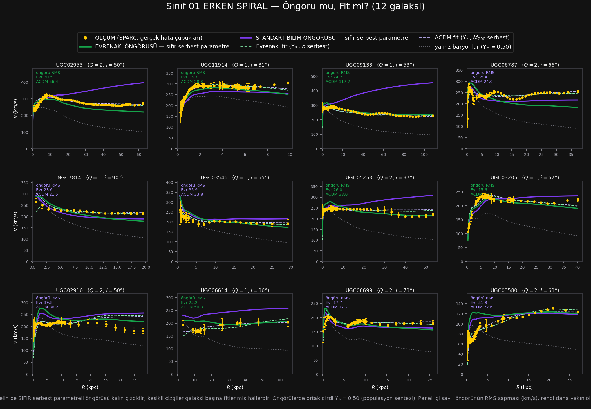

# Sınıf 01 — Erken Spiral (Sa – Sab) · Çalışma dosyası

> ### ⚡ NİHAİ KURULUM GÜNCELLEMESİ (1 Ağustos 2026 · karar: [86_NIHAI](../86_NIHAI/CALISMA.md))
>
> Teorinin galaktik denklemi değişti: $v^2=V_{bar}^2+\sqrt{\mathcal{G}M_{kaps}(R)\,a_0}$
> (yerel $\ell_\omega$) ve $a_0=1{,}75\times cH_0/16{,}1$. `HESAP/` altındaki
> `SONUC.csv`, `YONTEM.md`, `ongoru_vs_fit.png` ve `panel.html` **nihai kurulumla yenilendi.**
> Bu sınıfın nihai sayıları: öngörü RMS **25,82 (ΛCDM 30,69)** km/s · dış sapma **-2,1%** ·
> gereken $a_0$ çarpanı **×1,16** · öngörü yarışı **6/12**.
>
> Aşağıdaki metin ve tablolar **eski (A) kurulumun tarihsel kaydıdır** — silinmedi;
> güncel sayılar için `HESAP/` ve [toplu defter](../_HESAPLAR/toplu_defter.csv).

**12 galaksi · 434 ölçüm noktası · SPARC $T=1,2$ · kalite ve eğiklik süzgeçlerini geçmiş**

Hesap: `../../sinif_ongoru_vs_fit.py 01_erken_spiral`
Çıktılar: [`HESAP/SONUC.csv`](HESAP/SONUC.csv) · [`HESAP/YONTEM.md`](HESAP/YONTEM.md) · [`HESAP/ongoru_vs_fit.png`](HESAP/ongoru_vs_fit.png)

### ▶ [`HESAP/panel.html`](HESAP/panel.html) — etkileşimli panel

Tarayıcıda açın (çift tıklayın); **tek dosya, dış bağımlılık yok, internet gerekmez.**

| Ne yapar | Nasıl |
|---|---|
| 12 galaksiyi tek tek seç | soldaki liste · `◀ ▶` düğmeleri · `←` `→` ok tuşları |
| Sırayla gez | `▶ Oynat` (1,4 s aralık) · `boşluk` tuşu |
| **Her çizgiyi ayrı ayrı kapat/aç** | sağdaki dokuz onay kutusu |
| **Evrenakı girdilerini gör** | sağ panelde, her sayının rozetiyle |

Kapatılabilen dokuz çizgi: ölçüm (hata çubuklu) · Evrenakı öngörüsü · standart bilim öngörüsü ·
Evrenakı fit · ΛCDM fit · baryonlar toplamı · ve bileşenler ayrı ayrı: **disk**, **kovan**, **gaz**.

Evrenakı girdileri paneli, öngörü eğrisinin **tam olarak hangi dört sayıdan** üretildiğini
rozetleriyle gösterir — örnek (UGC02953):

| Girdi | Değer | Rozet |
|---|---|---|
| $\mathcal{G}=\alpha/\rho_n$ | $4{,}30\times10^{-6}$ kpc(km/s)²/M☉ | **T** teoriden |
| $a_0=cH_0/16{,}1$ | $4{,}22\times10^{-11}$ m/s² | **S** kalibre |
| $\Upsilon_*$ (popülasyon sentezi) | 0,50 | **S** kalibre |
| $M_{bar}$ (kapsanan) | $1{,}49\times10^{11}$ M☉ | **Ö** bu galaksinin ölçümü |
| $\ell_\omega=\sqrt{\mathcal{G}M_{bar}/a_0}$ | 22,20 kpc | **T** türetilmiş |

ve altında denklem: $v^2(R)=V_{bar}^2(\Upsilon_*)+\mathcal{G}M_{kaps}(R)/\ell_\omega$

Karşılaştırma için fitlenmiş değerler de görünür ($\Upsilon_{*,fit}=0{,}529$,
$\ell_{\omega,fit}=12{,}57$ kpc) — yani öngörünün ne kadar kaydığı okunabilir.
Aynı panel ΛCDM tarafı için de var ($M_{200}$ abundance matching'den, $c_{200}$ Dutton & Macciò'dan).

*Not: aynı panel altı sınıfın hepsi için üretilmiştir —*
`python kur_etkilesimli.py <sinif_adi>`

---

## 1. Sorulan soru

Bu kitapta şimdiye kadar **her iki model de fitlendi** ve karşılaştırma "kim daha iyi uyduruyor"
sorusuydu. Oysa iki tarafın da **sıfır serbest parametreli bir öngörüsü** var ve o hiç kurulmadı.
Bu çalışma onu kurar.

| Eğri | Serbest parametre | Nereden geliyor |
|---|---|---|
| **Evrenakı öngörüsü** | **0** | $\ell_\omega=\sqrt{\mathcal{G}M_{bar}/a_0}$, $a_0=cH_0/16{,}1$, $\Upsilon_*=0{,}50$ |
| **Standart bilim öngörüsü** | **0** | $M_{200}\leftarrow$ abundance matching, $c_{200}\leftarrow$ Dutton & Macciò, $\Upsilon_*=0{,}50$ |
| Evrenakı fit | 2 | $\Upsilon_*$, $b$ |
| ΛCDM fit | 2 | $\Upsilon_*$, $M_{200}$ |

Öngörülerde **ortak girdi** $\Upsilon_*=0{,}50$ — adil olması için ikisinde de aynı.

---

## 2. Sonuç tablosu (12 galaksinin medyanı)

| Model | $k$ | RMS (km/s) | $\chi^2_{ind}$ | Hata çubuğu içinde |
|---|---|---|---|---|
| Yalnız baryonlar ($\Upsilon_*=0{,}50$) | 0 | 61,40 | 409,61 | %10 |
| **Standart bilim ÖNGÖRÜSÜ** | **0** | 30,69 | **50,49** | %10 |
| **Evrenakı ÖNGÖRÜSÜ** | **0** | **27,67** | 58,01 | %12 |
| ΛCDM fit | 2 | 15,47 | **3,50** | %45 |
| Evrenakı fit | 2 | **13,99** | 4,77 | %44 |

Öngörü yarışı, galaksi başına: **Evrenakı 7 / 12** ($+0{,}6\sigma$ — anlamlı değil).

---

## 3. Okuma — üç bulgu

### (a) Erken spirallerde **hiçbir model öngörmüyor**

Bu sınıfın en önemli sonucu ve iki tarafın da aleyhine. Öngörülerin ikisi de:

- RMS sapması **28–31 km/s** — ölçüm hata çubuklarının çok üstünde
- Model noktalarının yalnız **%10–12'si** ölçüm hata çubuğunun içinde

Karşılaştırma için: fitlendiğinde bu oran **%44–45**'e çıkıyor, RMS 14–15 km/s'ye düşüyor.
Yani erken spiral dönüş eğrileri, **her iki çatıda da ancak galaksi başına ayar yapılarak**
üretilebiliyor. "Teori/ΛCDM erken spirali öngörüyor" cümlesi kurulamaz.

### (b) İki öngörü **ters yönde** hata yapıyor

Dış yarıdaki işaretli sapma, $(\text{öngörü}-\text{ölçüm})/\text{ölçüm}$:

| | Medyan | Desen |
|---|---|---|
| **Evrenakı öngörüsü** | $\mathbf{-10{,}9\%}$ | 12 galaksinin **12'sinde de altta** kalıyor |
| **Standart bilim öngörüsü** | $\mathbf{+8{,}0\%}$ | 12 galaksinin 8'inde üstte kalıyor |

Bu tesadüf değil, **iki ayrı sistematik**:

- **Evrenakı sistematik olarak eksik itim üretiyor** — istisnasız 12/12. $a_0$'ın bu sınıf için
  fazla küçük olduğunu ya da $M_{kaps}$ kaynağının dış bölgede eksik kaldığını gösterir.
  İstisnasızlık önemlidir: rastgele bir dağılım değil, **tek yönlü bir kayma.**
- **ΛCDM sistematik olarak fazla halo veriyor** — abundance matching, bu ışıma değerlerine
  gereğinden büyük $M_{200}$ atıyor. Panellerde (UGC02953, UGC09133, UGC05253) mor eğrinin
  dışa doğru fırlaması budur.

İkisinin ortalaması $+0{,}9\%$ — yani ölçüm, iki öngörünün **tam ortasında** duruyor.

### (c) Fitlendiğinde ikisi ayırt edilemiyor, ve ölçütler ters yön gösteriyor

| | RMS | $\chi^2_{ind}$ |
|---|---|---|
| Evrenakı fit | **13,99** önde | 4,77 geride |
| ΛCDM fit | 15,47 geride | **3,50** önde |

RMS Evrenakı'yı, $\chi^2$ ΛCDM'i işaret ediyor. Fark: $\chi^2$ hata çubuğu küçük noktalara
ağırlık verir; RMS vermez. Bu sınıfta ikisi ayrışıyor — **hüküm ölçüte bağlı, yani hüküm yok.**

---

## 4. Dürüstlük kayıtları

1. **Hiçbir "öngörü" saf değildir.** $a_0$ katsayısı (16,1) SPARC'a kalibre edilmiştir ve çapraz
   doğrulamada $10{,}5$–$22{,}0$ arası oynar ($\pm$%40). Karşı tarafta $c_{200}$–$M_{200}$ ve
   abundance matching de fitlenmiş ilişkilerdir. Bu, **kalibre öngörü vs kalibre öngörü**
   karşılaştırmasıdır — "türetim vs türetim" değil. İki taraf bu bakımdan denk.
2. **$\Upsilon_*=0{,}50$ ölçülmüş bir sayı değil**, IMF varsayımına bağlı bandın orta değeri.
   Bandın uçları (0,3 ve 0,8) alınsa öngörüler kayar; bu duyarlılık bu sınıf için ölçülmedi.
3. **$N=12$ galaksi.** Öngörü yarışının $7/12$ çıkması $+0{,}6\sigma$'dır — hiçbir şey karara
   bağlanmaz. Bu sınıfın taşıdığı bilgi *hangi model kazandı* değil, **(a) ve (b) maddeleridir.**
4. **Uzaklık ve eğiklik sabitlendi.** Katalog değerlerinde tutuldu, önselli serbest bırakılmadı.
   SPARC literatüründeki standart pratik onları serbest bırakır; bu yapılmadı ve her iki modeli
   birden etkiler. Medyan uzaklık hatası bu sınıfta önemlidir çünkü $L\propto D^2$.

---

## 5. Bu sınıftan çıkan iş

| # | İş | Neden |
|---|---|---|
| 1 | $\Upsilon_*$'ı $0{,}3$ ve $0{,}8$ uçlarında tekrarla | öngörü sonucunun banda duyarlılığı bilinmiyor |
| 2 | $D$ ve $i$'yi önselli serbest bırak | standart pratik; her iki öngörüyü de kaydırabilir |
| 3 | **Evrenakı'nın 12/12 eksik itimini araştır** | istisnasız tek yönlü sapma, ya $a_0$ ya kaynak biçimi |
| 4 | Abundance matching'in fazla halo verdiğini doğrula | bağımsız bir $M_*$–$M_h$ ilişkisiyle (ör. Behroozi+2013) |
| 5 | Aynı hesabı diğer 5 sınıfa uygula | erken spiral tek başına desen vermez |

**Madde 3 bu sınıfın en somut çıktısıdır:** 12 galaksinin 12'sinde de aynı yönde sapma,
rastgelelikle açıklanamaz ve teorinin bu sınıfta **ölçülebilir, adreslenebilir bir açığı**
olduğunu gösterir.
