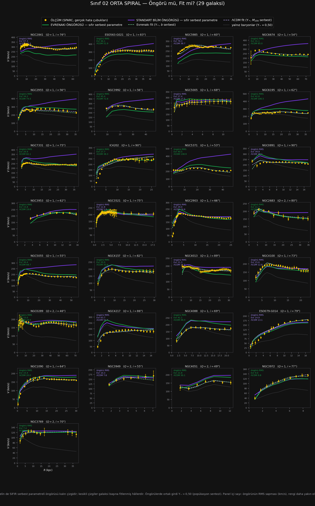

# Sınıf 02 — Orta Spiral (Sb – Sbc) · Çalışma dosyası

> ### ⚡ NİHAİ KURULUM GÜNCELLEMESİ (1 Ağustos 2026 · karar: [86_NIHAI](../86_NIHAI/CALISMA.md))
>
> Teorinin galaktik denklemi değişti: $v^2=V_{bar}^2+\sqrt{\mathcal{G}M_{kaps}(R)\,a_0}$
> (yerel $\ell_\omega$) ve $a_0=1{,}75\times cH_0/16{,}1$. `HESAP/` altındaki
> `SONUC.csv`, `YONTEM.md`, `ongoru_vs_fit.png` ve `panel.html` **nihai kurulumla yenilendi.**
> Bu sınıfın nihai sayıları: öngörü RMS **27,35 (ΛCDM 33,36)** km/s · dış sapma **+1,3%** ·
> gereken $a_0$ çarpanı **×0,90** · öngörü yarışı **18/29**.
>
> Aşağıdaki metin ve tablolar **eski (A) kurulumun tarihsel kaydıdır** — silinmedi;
> güncel sayılar için `HESAP/` ve [toplu defter](../_HESAPLAR/toplu_defter.csv).

**29 galaksi · SPARC $T=3,4$ · kalite ve eğiklik süzgeçlerini geçmiş**

Hesap: `../../sinif_ongoru_vs_fit.py 02_orta_spiral`
Çıktılar: [`HESAP/SONUC.csv`](HESAP/SONUC.csv) · [`HESAP/YONTEM.md`](HESAP/YONTEM.md) · [`HESAP/ongoru_vs_fit.png`](HESAP/ongoru_vs_fit.png)

### ▶ [`HESAP/panel.html`](HESAP/panel.html) — etkileşimli panel

Tarayıcıda açın; tek dosya, dış bağımlılık yok. 29 galaksi tek tek seçilir (`◀ ▶`, ok tuşları,
`▶ Oynat`), dokuz çizgi ayrı ayrı kapatılır, Evrenakı ve ΛCDM girdileri rozetleriyle görünür.
Kurulum ve rozet açıklamaları: [`../01_erken_spiral/CALISMA.md`](../01_erken_spiral/CALISMA.md).

---

## 1. Kurulum

Sınıf 01 ile **birebir aynı** — dört eğri, ikisi sıfır serbest parametreli öngörü, ikisi fit.
Ortak girdi $\Upsilon_*=0{,}50$. Ayrıntı: [`HESAP/YONTEM.md`](HESAP/YONTEM.md).

---

## 2. Sonuç tablosu (29 galaksinin medyanı)

| Model | $k$ | RMS (km/s) | $\chi^2_{ind}$ | Hata çubuğu içinde |
|---|---|---|---|---|
| Yalnız baryonlar ($\Upsilon_*=0{,}50$) | 0 | 53,48 | 139,55 | %7 |
| Standart bilim ÖNGÖRÜSÜ | 0 | 33,36 | 40,40 | %11 |
| **Evrenakı ÖNGÖRÜSÜ** | **0** | **25,35** | **18,95** | %12 |
| **ΛCDM fit** | 2 | **8,37** | **1,82** | **%54** |
| Evrenakı fit | 2 | 8,89 | 2,10 | %50 |

Öngörü yarışı: **Evrenakı 15 / 29** ($+0{,}2\sigma$ — tam beraberlik).

---

## 3. Okuma — dört bulgu

### (a) Öngörü sıralaması Evrenakı lehine, **ama sebebi üstünlük değil, ΛCDM'in felaketleri**

Medyanda Evrenakı öngörüsü her iki ölçütte de önde: RMS 25,35'e karşı 33,36 ve $\chi^2_{ind}$
18,95'e karşı 40,40 — **iki kattan fazla.** Ama galaksi başına oy **15/29**, yani beraberlik.
Bu ikisi ancak dağılımın kuyruğuna bakılınca uzlaşır:

| Öngörü RMS (km/s) | Evrenakı | ΛCDM |
|---|---|---|
| %25 dilim | 14,8 | 17,8 |
| %50 dilim | 25,4 | 33,4 |
| %75 dilim | 30,8 | **52,4** |
| %90 dilim | 61,2 | **82,7** |
| en kötü | 101,3 | **138,9** |
| RMS > 50 olan | 6/29 | **9/29** |
| RMS > 80 (felaket) | 2/29 | **4/29** |

ΛCDM'in en kötüleri: NGC5371 (139), NGC6195 (107), NGC6674 (85 km/s).
Evrenakı'nın en kötüleri: NGC5985 (101), NGC2841 (90), ESO563-G021 (67 km/s).

**Yani medyan farkı, tipik galakside üstünlükten değil, ΛCDM öngörüsünün daha sık ve daha ağır
çökmesinden geliyor.** Bu, "Evrenakı orta spiralleri daha iyi öngörür" demek için yeterli değil;
"abundance matching bu kütlelerde daha sık ışıyor" demek için yeterli.

### (b) **İki sınıflık desen artık kurulmuş: Evrenakı altta, ΛCDM üstte**

Dış yarıda işaretli sapma $(\text{öngörü}-\text{ölçüm})/\text{ölçüm}$:

| | Sa–Sab (12) | Sb–Sbc (29) |
|---|---|---|
| **Evrenakı** | $-10{,}9\%$ · **12/12 altta** | $-6{,}2\%$ · 23/29 altta |
| **Standart bilim** | $+8{,}0\%$ · 8/12 üstte | $\mathbf{+13{,}1\%}$ · **25/29 üstte** |

İki bağımsız sınıfta aynı yön. Tek sınıflık bir tesadüf değil, **iki ayrı sistematik**:

- **Evrenakı sistematik eksik itim üretiyor** — ama şiddeti azalıyor ($-10{,}9\% \to -6{,}2\%$,
  istisnasızlık %100'den %79'a düşüyor).
- **ΛCDM'in fazla halosu ise artıyor** ($+8{,}0\% \to +13{,}1\%$, %67'den %86'ya). Abundance
  matching, bu ışıma aralığında sistematik olarak gereğinden büyük $M_{200}$ atıyor. Panellerde
  mor eğrinin dışa doğru fırlaması (NGC5371, NGC6195, NGC2955, NGC6674) budur.

### (c) Yine hiçbir model öngörmüyor — ama bu sınıf sınıf 01'den kolay

Öngörülerin ikisi de noktaların yalnız **%11–12'sini** hata çubuğu içine sokuyor; fitler %50–54.
Sonuç sınıf 01 ile aynı: **erken ve orta spiral dönüş eğrileri her iki çatıda da ancak galaksi
başına ayarla üretiliyor.**

Ama iki sınıf arasında belirgin fark var — bu sınıf **daha kolay**:

| | Sa–Sab | Sb–Sbc |
|---|---|---|
| Evrenakı öngörü $\chi^2_{ind}$ | 58,01 | **18,95** (3,1 kat iyi) |
| Evrenakı fit RMS | 13,99 | **8,89** |
| ΛCDM fit RMS | 15,47 | **8,37** |
| Fitte hata çubuğu içinde | %44–45 | **%50–54** |

Evrenakı öngörüsünün $\chi^2$'si üç kattan fazla düzeliyor. Kovan payının azalması ve eğrilerin
daha düzgün olması muhtemel sebep; ölçülmedi.

### (d) Fitlendiğinde ΛCDM bir tık önde, ama fark küçük

| | RMS | $\chi^2_{ind}$ | Hata içinde |
|---|---|---|---|
| ΛCDM fit | **8,37** | **1,82** | **%54** |
| Evrenakı fit | 8,89 | 2,10 | %50 |

Sınıf 01'de ölçütler ters yön gösteriyordu (RMS Evrenakı'yı, $\chi^2$ ΛCDM'i). Burada **üç ölçüt
de aynı yönü gösteriyor: ΛCDM.** Fark küçük ama tutarlı. Not: $\chi^2_{ind}\approx2$ ve noktaların
yarısı hata çubuğu içinde — **her iki fit de bu sınıfta iyi çalışıyor.**

---

## 4. Dürüstlük kayıtları

1. Sınıf 01'in kayıtlarının tamamı burada da geçerli: hiçbir "öngörü" saf değil ($a_0$ katsayısı
   SPARC'a kalibre ve $\pm$%40 kararsız; $c$–$M$ ve abundance matching de fitlenmiş ilişkiler),
   $\Upsilon_*=0{,}50$ ölçüm değil bandın orta değeri, $D$ ve $i$ sabit tutuldu.
2. **Öngörü yarışı beraberlik ($15/29$).** Madde (a)'da anlatılan medyan farkı bir "kazanma"
   olarak okunmamalıdır.
3. **$\Upsilon_*$ bandına duyarlılık bu sınıfta da ölçülmedi.** Öngörüler $0{,}3$ ve $0{,}8$
   uçlarında tekrarlanmalı.
4. Bu sınıfta 29 galaksi var ama **$Q=2$ olanlar 5 tane**; kalite kırılımı ayrıca sınanmadı.

---

## 5. İki sınıftan çıkan ortak iş

| # | İş | Neden |
|---|---|---|
| 1 | **Evrenakı'nın sistematik eksik itimini adresle** | iki sınıfta da aynı yön (12/12 ve 23/29); ya $a_0$ ya $M_{kaps}$'ın dış bölge biçimi |
| 2 | **Abundance matching'in fazla halo verdiğini bağımsız ilişkiyle sına** | ΛCDM öngörü hatasının ana kaynağı; Behroozi+2013 ile tekrarla |
| 3 | $\Upsilon_*$ duyarlılığı (0,3 / 0,8) | her iki öngörüyü de kaydırabilir, hiç ölçülmedi |
| 4 | $D$ ve $i$'yi önselli serbest bırak | standart pratik; sapmaların ne kadarı bunlardan? |
| 5 | Kalan dört sınıfı tamamla | desenin tipe göre gidişi ancak altı sınıfla görülür |

**Madde 1 ve 2 artık iki sınıflık kanıta dayanıyor** — sınıf 01'de tek sınıflık gözlemdi, şimdi
tekrarlandı. İkisi de **ölçülebilir ve adreslenebilir** sistematiklerdir; ikisi de kendi tarafının
aleyhinedir.

*Sıradaki: `03_gec_spiral` (Sc–Scd, 30 galaksi).*
