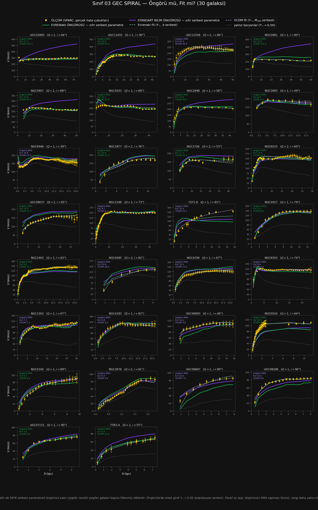

# Sınıf 03 — Geç Spiral (Sc – Scd) · Çalışma dosyası

> ### ⚡ NİHAİ KURULUM GÜNCELLEMESİ (1 Ağustos 2026 · karar: [86_NIHAI](../86_NIHAI/CALISMA.md))
>
> Teorinin galaktik denklemi değişti: $v^2=V_{bar}^2+\sqrt{\mathcal{G}M_{kaps}(R)\,a_0}$
> (yerel $\ell_\omega$) ve $a_0=1{,}75\times cH_0/16{,}1$. `HESAP/` altındaki
> `SONUC.csv`, `YONTEM.md`, `ongoru_vs_fit.png` ve `panel.html` **nihai kurulumla yenilendi.**
> Bu sınıfın nihai sayıları: öngörü RMS **16,65 (ΛCDM 13,39)** km/s · dış sapma **-1,3%** ·
> gereken $a_0$ çarpanı **×1,08** · öngörü yarışı **17/30**.
>
> Aşağıdaki metin ve tablolar **eski (A) kurulumun tarihsel kaydıdır** — silinmedi;
> güncel sayılar için `HESAP/` ve [toplu defter](../_HESAPLAR/toplu_defter.csv).

**30 galaksi · SPARC $T=5,6$ · $Q{=}1$: 23, $Q{=}2$: 7**

Hesap: `../../sinif_ongoru_vs_fit.py 03_gec_spiral`
Çıktılar: [`HESAP/SONUC.csv`](HESAP/SONUC.csv) · [`HESAP/YONTEM.md`](HESAP/YONTEM.md) · [`HESAP/ongoru_vs_fit.png`](HESAP/ongoru_vs_fit.png) · [`HESAP/panel.html`](HESAP/panel.html)

Kurulum sınıf 01 ve 02 ile birebir aynı. Panel kullanımı: [`../01_erken_spiral/CALISMA.md`](../01_erken_spiral/CALISMA.md).

---

## 1. Sonuç tablosu (30 galaksinin medyanı)

| Model | $k$ | RMS (km/s) | $\chi^2_{ind}$ | Hata çubuğu içinde |
|---|---|---|---|---|
| Yalnız baryonlar ($\Upsilon_*=0{,}50$) | 0 | 50,83 | 124,44 | **%0** |
| **Standart bilim ÖNGÖRÜSÜ** | **0** | **13,39** | **9,81** | **%15** |
| Evrenakı ÖNGÖRÜSÜ | 0 | 21,35 | 24,35 | %4 |
| ΛCDM fit | 2 | 7,74 | **2,22** | %60 |
| **Evrenakı fit** | 2 | **6,49** | 2,24 | **%61** |

Öngörü yarışı: **Evrenakı 13 / 30** ($-0{,}7\sigma$).

---

## 2. Okuma — bu sınıf teorinin aleyhine

### (a) Standart bilimin öngörüsü bu sınıfta **açık ara kazanıyor**

Üç ölçütün üçü de aynı yönü gösteriyor ve fark küçük değil:

| | Evrenakı | ΛCDM |
|---|---|---|
| RMS | 21,35 | **13,39** (%37 daha yakın) |
| $\chi^2_{ind}$ | 24,35 | **9,81** (2,5 kat) |
| Hata çubuğu içinde | %4 | **%15** |

İlk iki sınıfta öngörü yarışı beraberlik ya da Evrenakı lehineydi. **Burada değil.** Grafikte
sebebi çıplak gözle görünüyor: yeşil eğri (Evrenakı öngörüsü) panellerin büyük kısmında verinin
belirgin biçimde **altında** seyrediyor; mor eğri veriyi çoğu galakside takip ediyor.

Evrenakı öngörüsünün noktaların yalnız **%4'ünü** hata çubuğu içine sokması, üç sınıfın en kötü
değeri. (Karşılaştırma: yalnız baryonlar %0.)

### (b) Sebep belli: Evrenakı'nın eksik itimi bu sınıfta en şiddetli

Dış yarıda işaretli sapma:

| Sınıf | Evrenakı | ΛCDM |
|---|---|---|
| Sa–Sab (12) | $-10{,}9\%$ · 12/12 altta | $+8{,}0\%$ · 8/12 üstte |
| Sb–Sbc (29) | $-6{,}2\%$ · 23/29 altta | $+13{,}1\%$ · 25/29 üstte |
| **Sc–Scd (30)** | $\mathbf{-13{,}5\%}$ · **26/30 altta** | $+4{,}6\%$ · 18/30 üstte |

**İşaret üç sınıfın üçünde de aynı: Evrenakı altta, ΛCDM üstte.** Bu artık üç bağımsız
altörneklemde tekrarlanmış bir sistematik.

Ama **şiddet tipe göre düzgün gitmiyor:** $-10{,}9 \to -6{,}2 \to -13{,}5$. Yani basit bir
"Hubble tipiyle artıyor/azalıyor" eğilimi yok. Sebep morfolojik tipin kendisi değil, tipin
içindeki başka bir değişken olmalı — muhtemel adaylar yüzey parlaklığı ve gaz kesri; ölçülmedi.

### (c) ΛCDM'in felaketleri sürüyor ama medyanı kurtarıyor

| Öngörü RMS (km/s) | Evrenakı | ΛCDM |
|---|---|---|
| %25 dilim | 13,5 | **8,4** |
| %50 dilim | 21,4 | **13,4** |
| %75 dilim | 29,8 | 25,7 |
| %90 dilim | **35,8** | 69,7 |
| en kötü | **70,7** | 157,5 |
| RMS > 50 | **1/30** | 4/30 |
| RMS > 80 (felaket) | **0/30** | 3/30 |

ΛCDM'in davranışı **iki kutuplu**: galaksilerin çoğunda çok iyi, dördünde tamamen ışıyor
(UGC02885: 157, NGC0801: 132, UGC11455: 91 km/s). Evrenakı ise **daha tutarlı ama sistematik
olarak geride** — tek galakside 50'yi geçiyor, hiç felaketi yok, ama medyanı kötü.

Bu, iki modelin hata karakterinin farklı olduğunu gösteriyor: ΛCDM'in hatası **seyrek ve büyük**,
Evrenakı'nın hatası **yaygın ve orta**.

### (d) Fitlendiğinde beraberlik — ve üç sınıfın en iyi fitleri

| | RMS | $\chi^2_{ind}$ | Hata içinde |
|---|---|---|---|
| Evrenakı fit | **6,49** | 2,24 | **%61** |
| ΛCDM fit | 7,74 | **2,22** | %60 |

Ölçütler ayrışıyor, fark ihmal edilebilir: **fitte beraberlik.** Ve her iki fit de bu sınıfta üç
sınıfın en iyi değerlerini veriyor (%60–61 hata çubuğu içinde).

Buradan bir gözlem çıkıyor: **Evrenakı'nın fiti tipe göre düzenli iyileşiyor** ($13{,}99 \to
8{,}89 \to 6{,}49$), ama **öngörüsü iyileşmiyor** ($27{,}67 \to 25{,}35 \to 21{,}35$ — evet düşüyor,
ama ΛCDM'e göre geriye düşüyor). Yani teorinin **esnekliği** geç tiplerde daha çok işe yarıyor,
**parametresiz hâli** yaramıyor.

---

## 3. Dürüstlük kayıtları

1. Sınıf 01 ve 02'nin bütün kayıtları geçerli: $a_0$ katsayısı kalibre ve $\pm$%40 kararsız;
   $c$–$M$ ve abundance matching fitlenmiş ilişkiler; $\Upsilon_*=0{,}50$ bandın orta değeri;
   $D$ ve $i$ sabit tutuldu.
2. **Bu sınıfın sonucu tek başına da kitabın önceki bulgusuyla uyumlu.** Tip tip dökümde
   (6.5.3.6) Sc %44 ve Scd %31 ile teorinin en zayıf spiral tipleriydi; burada öngörü düzeyinde
   de aynı çıkıyor. Yani sürpriz değil, **tekrarlanmış bir zayıflık.**
3. $\Upsilon_*$ bandına duyarlılık üç sınıfın hiçbirinde ölçülmedi. Bu, öngörü hükümlerinin
   tamamı için açık bir çekince.
4. Evrenakı öngörüsünün %4'lük hata-çubuğu-içi oranı, dilim tablosuyla birlikte okunmalı: model
   yaygın olarak **hafifçe** altta, yani çok sayıda noktayı kıl payı kaçırıyor.

---

## 4. Üç sınıflık ara tablo

| | Sa–Sab | Sb–Sbc | Sc–Scd | Kazanan |
|---|---|---|---|---|
| **Öngörü** RMS Evr / ΛCDM | 27,7 / 30,7 | 25,4 / **33,4** | 21,4 / **13,4** | 1 Evr · 1 Evr · 1 ΛCDM |
| **Öngörü** $\chi^2$ Evr / ΛCDM | 58,0 / **50,5** | **19,0** / 40,4 | 24,4 / **9,8** | 1 ΛCDM · 1 Evr · 1 ΛCDM |
| Öngörü oyu (Evr) | 7/12 | 15/29 | 13/30 | beraberlik · beraberlik · ΛCDM |
| **Fit** RMS Evr / ΛCDM | **14,0** / 15,5 | 8,9 / **8,4** | **6,5** / 7,7 | karışık |
| Fit hata içinde | %44 / %45 | %50 / %54 | %61 / %60 | karışık |
| Evr dış sapma | $-10{,}9\%$ | $-6{,}2\%$ | $-13{,}5\%$ | **hep altta** |
| ΛCDM dış sapma | $+8{,}0\%$ | $+13{,}1\%$ | $+4{,}6\%$ | **hep üstte** |

**Üç sınıfın ortak ve tek sağlam sonucu son iki satır:** işaret hiç değişmiyor. Geri kalan her
şey sınıfa ve ölçüte göre gidiyor gelmiyor — yani **genel bir kazanan yok, sınıf sınıf bile yok.**

---

## 5. Bu sınıftan çıkan iş

| # | İş | Neden |
|---|---|---|
| 1 | Eksik itimin **hangi değişkenle** ölçeklendiğini bul | tipe göre düzgün gitmiyor; yüzey parlaklığı ve gaz kesri sına |
| 2 | ΛCDM'in dört felaketini incele (UGC02885, NGC0801, UGC11455, NGC5907) | abundance matching'in nerede kırıldığını gösterir |
| 3 | $\Upsilon_*$ duyarlılığı — artık üç sınıf için birden | öngörü hükümlerinin tamamının çekincesi |
| 4 | Kalan üç sınıfı tamamla | Sd, Macellan, düzensiz |

**Madde 1 en önemlisi:** eksik itim üç sınıfta da var ama şiddeti morfolojiyle açıklanamıyor.
Doğru değişken bulunursa bu, teorinin adreslenebilir tek somut açığını **niceliksel** hâle getirir.

*Sıradaki: `04_cok_gec_spiral` (Sd, 16 galaksi).*
