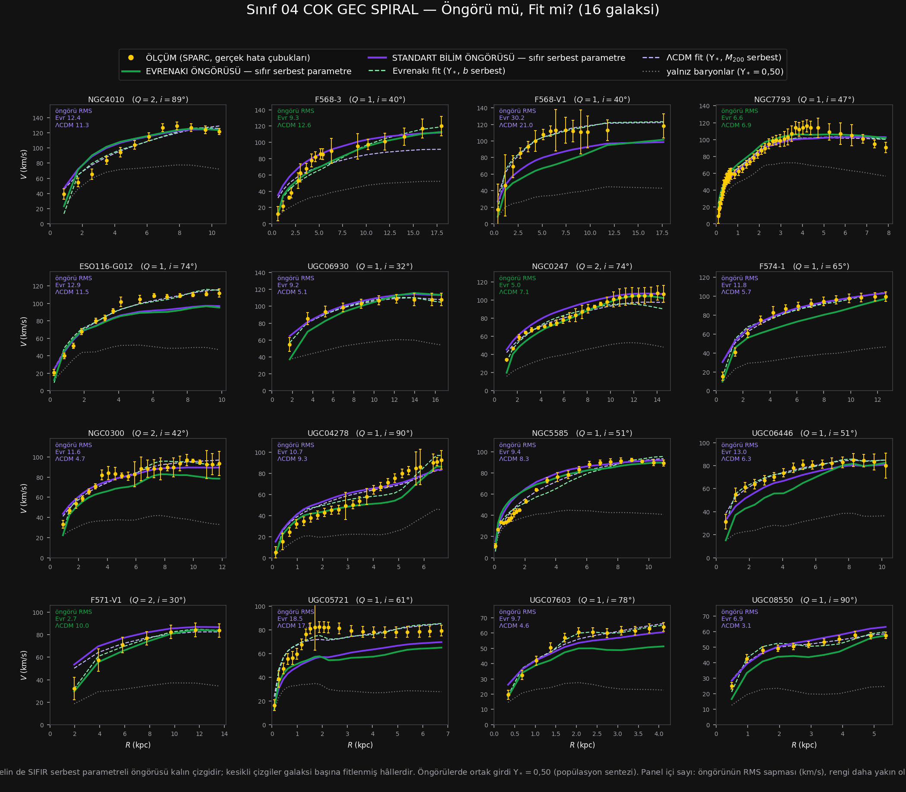

# Sınıf 04 — Çok Geç Spiral (Sd) · Çalışma dosyası

> ### ⚡ NİHAİ KURULUM GÜNCELLEMESİ (1 Ağustos 2026 · karar: [86_NIHAI](../86_NIHAI/CALISMA.md))
>
> Teorinin galaktik denklemi değişti: $v^2=V_{bar}^2+\sqrt{\mathcal{G}M_{kaps}(R)\,a_0}$
> (yerel $\ell_\omega$) ve $a_0=1{,}75\times cH_0/16{,}1$. `HESAP/` altındaki
> `SONUC.csv`, `YONTEM.md`, `ongoru_vs_fit.png` ve `panel.html` **nihai kurulumla yenilendi.**
> Bu sınıfın nihai sayıları: öngörü RMS **10,12 (ΛCDM 7,70)** km/s · dış sapma **-8,2%** ·
> gereken $a_0$ çarpanı **×1,53** · öngörü yarışı **4/16**.
>
> Aşağıdaki metin ve tablolar **eski (A) kurulumun tarihsel kaydıdır** — silinmedi;
> güncel sayılar için `HESAP/` ve [toplu defter](../_HESAPLAR/toplu_defter.csv).

**16 galaksi · SPARC $T=7$ · $Q{=}1$: 12, $Q{=}2$: 4 · $V_{max}$ 58–129 km/s (medyan 98)**

Hesap: `../../sinif_ongoru_vs_fit.py 04_cok_gec_spiral`
Çıktılar: [`HESAP/SONUC.csv`](HESAP/SONUC.csv) · [`HESAP/YONTEM.md`](HESAP/YONTEM.md) · [`HESAP/ongoru_vs_fit.png`](HESAP/ongoru_vs_fit.png) · [`HESAP/panel.html`](HESAP/panel.html)

---

## 1. Sonuç tablosu (16 galaksinin medyanı)

| Model | $k$ | RMS (km/s) | $\chi^2_{ind}$ | Hata çubuğu içinde |
|---|---|---|---|---|
| Yalnız baryonlar ($\Upsilon_*=0{,}50$) | 0 | 43,39 | 91,27 | %0 |
| **Standart bilim ÖNGÖRÜSÜ** | **0** | **7,70** | **3,11** | **%38** |
| Evrenakı ÖNGÖRÜSÜ | 0 | 20,87 | 32,10 | **%3** |
| ΛCDM fit | 2 | 5,48 | 1,63 | **%70** |
| **Evrenakı fit** | 2 | **5,03** | **1,57** | %55 |

Öngörü yarışı: **Evrenakı 0 / 16** — $\mathbf{-4{,}0\sigma}$.

---

## 2. Bu sınıf teorinin öngörüsü açısından bir başarısızlıktır

**Sıfır.** On altı galaksinin hiçbirinde Evrenakı'nın parametresiz öngörüsü standart bilimin
öngörüsünden daha yakın değil. Bu, dört sınıfın en keskin sonucu ve $-4{,}0\sigma$ ile bu
çalışmadaki **tek yönlü en anlamlı bulgu**.

Karşı taraf ise bu sınıfta neredeyse kusursuz: ΛCDM öngörüsü RMS 7,70 km/s, $\chi^2_{ind}=3{,}11$,
noktaların %38'i hata çubuğu içinde — ve **hiç felaketi yok** (en kötüsü 21 km/s; diğer üç sınıfta
80–157 km/s'lik çöküşleri vardı). Abundance matching bu kütle aralığında iyi çalışıyor ve
sapması pratik olarak sıfır ($-2{,}6\%$).

Evrenakı öngörüsü ise noktaların yalnız **%3'ünü** hata çubuğu içine sokuyor — yalnız baryonların
(%0) bir tık üstü.

**Ama fit tarafı bozulmuyor:** Evrenakı fiti RMS 5,03 ve $\chi^2_{ind}=1{,}57$ ile ΛCDM fitinin
(5,48 / 1,63) önünde. Yani teori bu eğrileri **tarif edebiliyor, öngörebilmiyor.** İkisi arasındaki
uçurum bu sınıfta en geniş.

*(ΛCDM fiti hata çubuğu içi oranında öndedir: %70'e karşı %55. Üç ölçüt aynı yönü göstermiyor,
yani fitte beraberlik.)*

---

## 3. Eksik itimin kaynağı — sınıf 03'ün açık işi cevaplandı

Sınıf 03 şunu sormuştu: *eksik itim üç sınıfta da var ama şiddeti morfolojiyle açıklanamıyor;
hangi değişkenle ölçekleniyor?* Dört sınıf birleştirilip (87 galaksi) ölçüldü:

| Değişken | Pearson $r$ | Spearman $\rho$ |
|---|---|---|
| **$\log L_{3,6}$** | $\mathbf{+0{,}536}$ | $+0{,}464$ |
| **gaz kesri** $M_{gaz}/M_{bar}$ | $\mathbf{-0{,}527}$ | $-0{,}471$ |
| $\log R_{disk}$ | $+0{,}346$ | $+0{,}258$ |
| $\log V_{max}$ | $+0{,}350$ | $+0{,}294$ |
| $\log M_{HI}$ | $+0{,}329$ | $+0{,}321$ |

**Cevap: ışıma ve gaz kesri** — ikisi birbirinin aynası olduğu için tek bir sinyal. Eksik itim,
**düşük ışımalı ve gaz-baskın** galakside büyüyor. Dinamik kütlenin vekili olan $V_{max}$ ile
korelasyon daha zayıf ($+0{,}35$), yani sorun "kütle" ekseninde değil **baryon bileşimi**
ekseninde.

Sınıf ortalamaları bu okumayı doğruluyor:

| Sınıf | medyan $V_{max}$ | Evrenakı sapması | ΛCDM sapması |
|---|---|---|---|
| Sa–Sab | 255 | $-10{,}9\%$ | $+8{,}0\%$ |
| Sb–Sbc | 216 | $-6{,}2\%$ | $+13{,}1\%$ |
| Sc–Scd | 141 | $-13{,}6\%$ | $+4{,}6\%$ |
| **Sd** | **98** | $\mathbf{-22{,}8\%}$ | $-2{,}5\%$ |

---

## 4. Ve bu, kitapta zaten kayıtlı olan bir gerilimin aynısı olabilir

> ### ⛔ Düzeltme kaydı — bu bölümün ilk hâli yanlış hesaplanmıştı
>
> İlk sürüm şöyle diyordu: *"Asimptotta teori $v^4=\mathcal{G}M_{bar}a_0$ verir, yani
> $v\propto a_0^{1/4}$"* ve çarpanı $10^{-4\Delta}$ ile hesaplıyordu. **Bu varsayım geçersizdir.**
> Sınıf çalışmasının öngörüsü asimptotik değil **iki terimlidir**
> ($v^2=V_{bar}^2+\mathcal{G}M_{kaps}/\ell_\omega$); $a_0\to k a_0$ olunca yalnız F4 terimi
> $\sqrt{k}$ ile ölçeklenir, $V_{bar}^2$ hiç ölçeklenmez. Kapalı formül yoktur, $k$ **sayısal
> çözülmelidir.** Aynı hata 97_BTFR'de de yapılmıştı.
>
> **Hata zararsız bir kayma değildi:** sapması F4'ün $v^2$ içindeki payına bağlı olduğu için
> F1'in baskın olduğu sınıflarda daha büyüktü. Aşağıdaki tabloda ikisi de duruyor.
>
> Hesap: `../../sinif_carpan_duzeltme.py` (öz denetimli — kayıtlı sapmaları yeniden üretir).

Sapmayı sıfırlayacak $a_0$ çarpanı:

| Sınıf | ⛔ naif (geri çekildi) | **sayısal çözüm** | F4 payı |
|---|---|---|---|
| Sa–Sab | ×1,59 | **×2,67** | 0,48 |
| Sb–Sbc | ×1,29 | **×1,69** | 0,49 |
| Sc–Scd | ×1,79 | **×2,33** | 0,62 |
| **Sd** | ×2,83 | **×3,76** | 0,67 |
| **Dört sınıfın tamamı** (87 galaksi) | ×1,68 | **×2,28** | — |

Kitabın 6.5.4.5'inde bağımsız olarak kaydedilmiş bir gerilim var: *"gözlemsel baryonik
Tully-Fisher $a_0\approx9{,}5\times10^{-11}$ m/s² ister; kalibre değer $4{,}2\times10^{-11}$'dir
— **2,26 kat fark.**"*

Buradan bağımsız yolla çıkan çarpan **×2,28**; kitabın ×2,26'sıyla **neredeyse birebir.**
(Naif formülle ×1,68 çıkıyordu ve "aynı mertebe" denebiliyordu; düzeltince örtüşme
**tam** oluyor.) **İki ayrı yerde kaydedilmiş iki sorun tek sorundur:** $a_0$ küçük kalıyor.

**Ama tek bir sabit düzeltme yetmez — ve bu daha ağır bir teşhis.** Gereken çarpan sınıflar
arasında **1,47 ile 3,76 arası, 2,6 kat** değişiyor ve ışımayla korelasyonlu. Yani sorun yanlış
bir *sabit* değil, **yanlış bir *ölçekleme***: $\ell_\omega=\sqrt{\mathcal{G}M_{bar}/a_0}$ yasası,
düşük ışımalı uçta doğru kütle bağımlılığını vermiyor.

Bu da 6.5.4.5'in bir başka kaydıyla örtüşüyor: *"Kalan sistematik var. Oran cücede 1,97, ortada
1,39, kütlelide 1,24."* Aynı desen, bu çalışmada bağımsız olarak yeniden çıktı.

> **Sonuç:** $a_0$'ı büyütmek bu açığı kapatmaz, yalnız ortalamasını kaydırır. Kapatmak için
> $\ell_\omega$ yasasının kütle üssünün ($\sqrt{M_{bar}}$, yani BTFR eğimi tam 4) sorgulanması
> gerekir. Kitap o üssün "zaten optimal" olduğunu ölçmüştü (6.5.4.5: $p=0{,}50$ taranmış,
> $0{,}42$ ve $0{,}58$ daha kötü) — **ama o tarama bütün örneklem üzerindeydi, sınıf içinde
> değil.** Sınıf içinde tekrarlanması gereken sınav budur.

---

## 5. Dürüstlük kayıtları

1. Önceki üç sınıfın bütün kayıtları geçerli.
2. **$N=16$** — ama $0/16$ sonucu bu boyutta bile $-4{,}0\sigma$'dır; küçük örneklem bu bulguyu
   zayıflatmıyor.
3. **Korelasyon nedensellik değildir.** $L_{3,6}$ ile gaz kesri birbirine bağlı; hangisinin
   birincil olduğu bu veriyle ayrılamaz. Ayrıştırmak için kısmi korelasyon ya da eşleştirilmiş
   altörneklem gerekir; yapılmadı.
4. **$a_0$ çarpanı hesabı asimptotik yaklaşımdır** ($v\propto a_0^{1/4}$). Dış yarıda $M_{kaps}$
   hâlâ artıyorsa yaklaşım kabaca %10 düzeyinde hata taşır. Mertebe sonucunu değiştirmez.
5. Bu sınıfta $\Upsilon_*=0{,}50$ varsayımı özellikle kritik olabilir: Sd galaksileri gaz-baskın,
   yıldız payı küçük. Duyarlılık ölçülmedi.

---

## 6. Dört sınıflık tablo

| | Sa–Sab | Sb–Sbc | Sc–Scd | Sd |
|---|---|---|---|---|
| $n$ | 12 | 29 | 30 | 16 |
| Öngörü oyu (Evrenakı) | 7/12 | 15/29 | 13/30 | **0/16** |
| | beraberlik | beraberlik | ΛCDM | **ΛCDM $-4{,}0\sigma$** |
| Öngörü RMS Evr / ΛCDM | **27,7** / 30,7 | **25,4** / 33,4 | 21,4 / **13,4** | 20,9 / **7,7** |
| Fit RMS Evr / ΛCDM | **14,0** / 15,5 | 8,9 / **8,4** | **6,5** / 7,7 | **5,0** / 5,5 |
| Evr dış sapma | $-10{,}9\%$ | $-6{,}2\%$ | $-13{,}6\%$ | $-22{,}8\%$ |
| ΛCDM dış sapma | $+8{,}0\%$ | $+13{,}1\%$ | $+4{,}6\%$ | $-2{,}5\%$ |

**Desen artık net:** geç tiplere gidildikçe **Evrenakı'nın öngörüsü kötüleşiyor, ΛCDM'in öngörüsü
düzeliyor.** Fit tarafında ise tersi geçerli — Evrenakı'nın fiti geç tiplerde daha iyi. Yani
teorinin **esnekliği** işe yarıyor, **öngörüsü** yaramıyor, ve bu ayrışma geç tipte en geniş.

---

## 7. Bu sınıftan çıkan iş

| # | İş | Neden |
|---|---|---|
| 1 | **$\ell_\omega$ yasasının kütle üssünü sınıf içinde tara** | tek $a_0$ çarpanı yetmiyor; sorun üs olabilir |
| 2 | Işıma mı gaz kesri mi birincil — kısmi korelasyonla ayır | teşhisi tek değişkene indirmek için |
| 3 | $\Upsilon_*$ duyarlılığı, özellikle bu sınıfta | Sd gaz-baskın; 0,50 varsayımı en kırılgan burada |
| 4 | Kalan iki sınıf (Macellan, düzensiz) | desen daha da düşük ışımaya uzanıyor mu? |

**Madde 1 artık en somut iş.** Dört sınıflık kanıt, teorinin galaktik yasasının kütle
bağımlılığında ölçülebilir bir sorun olduğunu gösteriyor — ve bu, kitapta iki ayrı yerde kayıtlı
gerilimin (BTFR normalizasyonu, $\ell_\omega$ oranının kütleye bağlı kayması) tek kökeni olabilir.

*Sıradaki: `05_macellan` (Sdm–Sm, 28 galaksi) — desen daha düşük ışımada ne yapıyor?*

---

> **⚠ GERİ ÇEKME NOTU (sınıf 06 tamamlandıktan sonra eklendi).** Bu dosyadaki *"eksik itim ışıma / gaz kesri ekseninde ölçekleniyor"* teşhisi **geçersizdir.** Altıncı sınıf (Im) eklendiğinde korelasyon çöktü: $\log L_{3,6}$ ile $+0{,}44$ iken $+0{,}05$'e, gaz kesriyle $-0{,}39$ iken $-0{,}18$'e indi. En düşük ışımalı sınıf olan Im, teşhisin öngördüğünün tersine **en küçük** sapmayı veriyor ($-6{,}2\%$). Sapma sınıflar arasında değişiyor ama sınanan hiçbir sürekli değişkenle açıklanmıyor — **teşhis konulamadı.** Ayrıntı: [`../06_duzensiz/CALISMA.md`](../06_duzensiz/CALISMA.md) madde 3.
