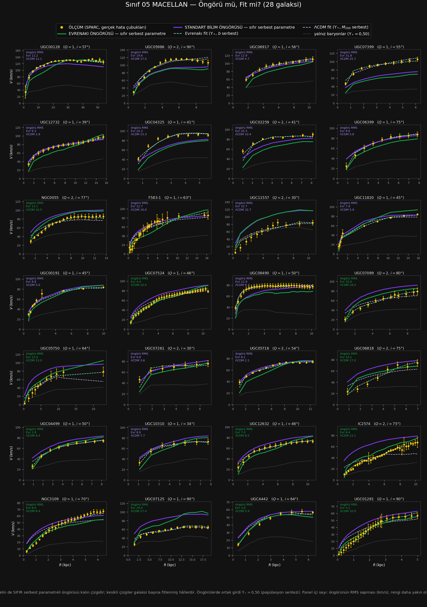

# Sınıf 05 — Macellan (Sdm – Sm) · Çalışma dosyası

> ### ⚡ NİHAİ KURULUM GÜNCELLEMESİ (1 Ağustos 2026 · karar: [86_NIHAI](../86_NIHAI/CALISMA.md))
>
> Teorinin galaktik denklemi değişti: $v^2=V_{bar}^2+\sqrt{\mathcal{G}M_{kaps}(R)\,a_0}$
> (yerel $\ell_\omega$) ve $a_0=1{,}75\times cH_0/16{,}1$. `HESAP/` altındaki
> `SONUC.csv`, `YONTEM.md`, `ongoru_vs_fit.png` ve `panel.html` **nihai kurulumla yenilendi.**
> Bu sınıfın nihai sayıları: öngörü RMS **9,89 (ΛCDM 9,97)** km/s · dış sapma **-2,0%** ·
> gereken $a_0$ çarpanı **×1,12** · öngörü yarışı **12/28**.
>
> Aşağıdaki metin ve tablolar **eski (A) kurulumun tarihsel kaydıdır** — silinmedi;
> güncel sayılar için `HESAP/` ve [toplu defter](../_HESAPLAR/toplu_defter.csv).

**28 galaksi · SPARC $T=8,9$ · $Q{=}1$: 19, $Q{=}2$: 9 · $V_{max}$ 57–134 km/s (medyan 82)**

Hesap: `../../sinif_ongoru_vs_fit.py 05_macellan` · Çapraz tanı: `../../sinif_capraz_tani.py`
Çıktılar: [`HESAP/SONUC.csv`](HESAP/SONUC.csv) · [`HESAP/YONTEM.md`](HESAP/YONTEM.md) · [`HESAP/ongoru_vs_fit.png`](HESAP/ongoru_vs_fit.png) · [`HESAP/panel.html`](HESAP/panel.html)

---

## 1. Sonuç tablosu (28 galaksinin medyanı)

| Model | $k$ | RMS (km/s) | $\chi^2_{ind}$ | Hata çubuğu içinde |
|---|---|---|---|---|
| Yalnız baryonlar ($\Upsilon_*=0{,}50$) | 0 | 32,57 | 125,33 | %0 |
| **Standart bilim ÖNGÖRÜSÜ** | **0** | **9,97** | **11,80** | **%11** |
| Evrenakı ÖNGÖRÜSÜ | 0 | 18,12 | 28,53 | %2 |
| ΛCDM fit | 2 | 4,60 | 2,28 | %59 |
| **Evrenakı fit** | 2 | **3,73** | **1,19** | **%69** |

Öngörü yarışı: **Evrenakı 8 / 28** ($-2{,}3\sigma$).

---

## 2. Bu sınıfın çelişkisi: öngörü kaybediyor, fit beş sınıfın en iyisi

İki sonuç aynı sınıfta yan yana duruyor ve ters yönü işaret ediyor:

- **Öngörü:** Evrenakı kaybediyor, hem medyanda (18,12'ye karşı 9,97) hem oyda ($8/28$,
  $-2{,}3\sigma$). Noktaların yalnız **%2'si** hata çubuğu içinde.
- **Fit:** Evrenakı **üç ölçütün üçünde de kazanıyor** — RMS 3,73 / 4,60 · $\chi^2_{ind}$
  **1,19** / 2,28 · hata içinde %69 / %59. $\chi^2_{ind}=1{,}19$ **formel olarak kabul edilebilir
  bir uyum** ve beş sınıfın en iyi değeri.

Bu çelişki tesadüf değil; mekanizması ölçüldü ve aşağıda.

---

## 3. Mekanizma — ve beklemediğim simetri

Öngörü $\Upsilon_*=0{,}50$ ile kurulur. Fit $\Upsilon_*$'ı serbest bırakınca ne oluyor?
(Popülasyon sentezi bandı $0{,}3$–$0{,}8$.)

| Sınıf | $\Upsilon_*$ Evrenakı | bant dışı | $\Upsilon_*$ ΛCDM | bant dışı | Evrenakı sapması |
|---|---|---|---|---|---|
| Sa–Sab | 0,42 | %8 | 0,52 | %17 | $-10{,}9\%$ |
| Sb–Sbc | 0,54 | %31 | 0,47 | %24 | $-6{,}2\%$ |
| Sc–Scd | 0,69 | %43 | 0,55 | %40 | $-13{,}6\%$ |
| Sd | **1,36** | **%81** | **0,24** | **%69** | $-22{,}8\%$ |
| **Sdm–Sm** | **1,64** | **%89** | **0,06** | **%89** | $-16{,}6\%$ |

**Evrenakı açığı yıldız kütlesini şişirerek kapatıyor.** Medyan $\Upsilon_*$ 0,42'den 1,64'e
çıkıyor; bu sınıfta galaksilerin %89'u fotometrik bandın dışında. Yani sınıf 04'te teşhis edilen
eksik itim, fitte $\Upsilon_*$'a yükleniyor.

**Ama beklemediğim şey şu: ΛCDM de aynı parametreyi kötüye kullanıyor — ters yönde.**
Bu sınıfta ΛCDM'in fitlediği medyan $\Upsilon_*$ **0,06**. Yani model "bu galaksilerde yıldız
neredeyse yok, hepsi halo" diyor. Popülasyon sentezi $0{,}3$–$0{,}8$ derken:

| | Fitlenen $\Upsilon_*$ | Banda göre |
|---|---|---|
| Evrenakı | 1,64 | **2,1 kat yüksek** |
| ΛCDM | 0,06 | **5,0 kat düşük** |

**Oran olarak ΛCDM'in ihlali daha büyük.** Ve her iki modelde de galaksilerin %89'u bandın dışında.

> **Bu, sınıf 05'in en önemli sonucudur:** geç tiplerdeki fit karşılaştırması, **aynı parametreyi
> zıt yönde kötüye kullanan iki model arasındadır.** Evrenakı'nın $\chi^2_{ind}=1{,}19$'u da
> ΛCDM'in 2,28'i de fiziksel olarak kabul edilebilir girdilerle elde edilmemiştir. "Evrenakı bu
> sınıfta daha iyi fit ediyor" cümlesi doğrudur ama **hiçbir şey kanıtlamaz** — iki taraf da
> fotometriyi görmezden sayıyor.

Bu bulgu, kitabın 6.5.4.7 kayıt (4)'ünde yalnız Evrenakı için tespit edilmiş "tavana dayanma"
sorununun **simetrik hâlidir** ve ΛCDM tarafı orada hiç ölçülmemişti.

---

## 4. Çapraz tanı — beş sınıflık toplam

`sinif_capraz_tani.py` ile 115 galaksi birleştirildi.

**Eksik itim neyle ölçekleniyor:**

| Değişken | Pearson $r$ | Spearman $\rho$ |
|---|---|---|
| **$\log L_{3,6}$** | $\mathbf{+0{,}442}$ | $+0{,}459$ |
| gaz kesri | $-0{,}388$ | $-0{,}418$ |
| $\log R_{disk}$ | $+0{,}362$ | $+0{,}351$ |
| $\log M_{HI}$ | $+0{,}341$ | $+0{,}373$ |
| $\log V_{max}$ | $+0{,}247$ | $+0{,}273$ |

Işıma en güçlü; dinamik kütlenin vekili $V_{max}$ en zayıf. **Sorun kütle ekseninde değil, baryon
bileşimi ekseninde.** (Işıma ve gaz kesri birbirinin aynası olduğu için hangisinin birincil olduğu
bu veriyle **ayrılamaz** — kısmi korelasyon gerekir, yapılmadı.)

**$a_0$ çarpanı** (⛔ ilk satır geri çekildi — naif $10^{-4\Delta}$ formülü; gerekçe
[04_cok_gec_spiral](../04_cok_gec_spiral/CALISMA.md) düzeltme kaydında):

| | Sa–Sab | Sb–Sbc | Sc–Scd | Sd | Sdm–Sm | **Tümü** |
|---|---|---|---|---|---|---|
| ⛔ naif | ×1,59 | ×1,29 | ×1,79 | ×2,83 | ×2,07 | ×1,79 |
| **sayısal** | **×2,67** | **×1,69** | **×2,33** | **×3,76** | **×2,84** | **×2,47** |

Çarpan **1,69–3,76 arası, 2,2 kat** değişiyor (beş sınıfta). **Tek sabit yetmez.** Kitabın
6.5.4.5'i bağımsız olarak ×2,26 istemişti — düzeltilmiş **×2,47** ile aynı yerde, ve o kayıt
da tek sabit varsayıyordu.

---

## 5. Beş sınıflık özet tablo

| Sınıf | $n$ | Öngörü RMS E/L | Fit $\chi^2$ E/L | Öngörü oyu |
|---|---|---|---|---|
| Sa–Sab | 12 | **27,7** / 30,7 | 4,78 / **3,50** | 7/12 $+0{,}6\sigma$ |
| Sb–Sbc | 29 | **25,4** / 33,4 | 2,10 / **1,82** | 15/29 $+0{,}2\sigma$ |
| Sc–Scd | 30 | 21,4 / **13,4** | 2,24 / **2,22** | 13/30 $-0{,}7\sigma$ |
| Sd | 16 | 20,9 / **7,7** | **1,57** / 1,63 | 0/16 $\mathbf{-4{,}0\sigma}$ |
| **Sdm–Sm** | 28 | 18,1 / **10,0** | **1,19** / 2,28 | 8/28 $-2{,}3\sigma$ |

**Desen tam tersine çevrilmiş bir çapraz:**

- **Öngörüde:** erken tiplerde Evrenakı önde (ya da beraberlik), geç tiplerde ΛCDM açık ara önde.
- **Fitte:** erken tiplerde ΛCDM önde, geç tiplerde Evrenakı önde.

Yani teorinin **esnekliği** geç tiplerde işe yarıyor, **parametresiz hâli** tam orada çöküyor.
Ve madde 3, bu esnekliğin ne olduğunu söylüyor: $\Upsilon_*$'ı fotometrik bandın iki katına
çıkarmak.

---

## 6. Dürüstlük kayıtları

1. Önceki dört sınıfın kayıtları geçerli.
2. **Bu sınıfın "en iyi fit" başlığı ($\chi^2_{ind}=1{,}19$) tek başına alıntılanmamalıdır.**
   $\Upsilon_*=1{,}64$ ile elde edilmiştir ve galaksilerin %89'u fotometrik bandın dışındadır.
3. **Aynı uyarı ΛCDM için de geçerli** ($\Upsilon_*=0{,}06$, %89 bant dışı). İki taraf simetrik
   biçimde kusurlu; hiçbiri diğerini bu sınıfta "kazanmış" saymaz.
4. Işıma ile gaz kesri ayrıştırılamadı (madde 4).
5. $a_0$ çarpanı asimptotik yaklaşımdır; mertebe güvenilir, ikinci hane değil.
6. Sd sınıfında ΛCDM'in $\Upsilon_*=0{,}24$'ü de bandın altında — yani ΛCDM'in ihlali Sd'de
   başlıyor, Sdm–Sm'de derinleşiyor.

---

## 7. Bu sınıftan çıkan iş

| # | İş | Neden |
|---|---|---|
| 1 | **Her iki modeli de $\Upsilon_*$ bandına hapsedip fitleri tekrarla** | geç tiplerdeki fit hükümlerinin tamamı bu olmadan geçersiz |
| 2 | $\ell_\omega$ kütle üssünü sınıf içinde tara | tek $a_0$ çarpanı yetmiyor (madde 4) |
| 3 | Işıma / gaz kesri ayrımı — kısmi korelasyon | teşhisi tek değişkene indirmek |
| 4 | Son sınıf: `06_duzensiz` (Im, 26) | desen en düşük ışımada ne yapıyor |

**Madde 1 artık en kritik iş.** Beş sınıfın fit karşılaştırmalarının hepsi, her iki modelin de
fotometrik önseli ihlal edebildiği bir kurulumda yapıldı. Bant dayatılınca ne kalacağı bilinmiyor
ve bu, **çalışmanın en büyük açık ucudur.**

*Sıradaki: `06_duzensiz` (Im, 26 galaksi) — son sınıf.*

---

> **⚠ GERİ ÇEKME NOTU (sınıf 06 tamamlandıktan sonra eklendi).** Bu dosyadaki *"eksik itim ışıma / gaz kesri ekseninde ölçekleniyor"* teşhisi **geçersizdir.** Altıncı sınıf (Im) eklendiğinde korelasyon çöktü: $\log L_{3,6}$ ile $+0{,}44$ iken $+0{,}05$'e, gaz kesriyle $-0{,}39$ iken $-0{,}18$'e indi. En düşük ışımalı sınıf olan Im, teşhisin öngördüğünün tersine **en küçük** sapmayı veriyor ($-6{,}2\%$). Sapma sınıflar arasında değişiyor ama sınanan hiçbir sürekli değişkenle açıklanmıyor — **teşhis konulamadı.** Ayrıntı: [`../06_duzensiz/CALISMA.md`](../06_duzensiz/CALISMA.md) madde 3.
