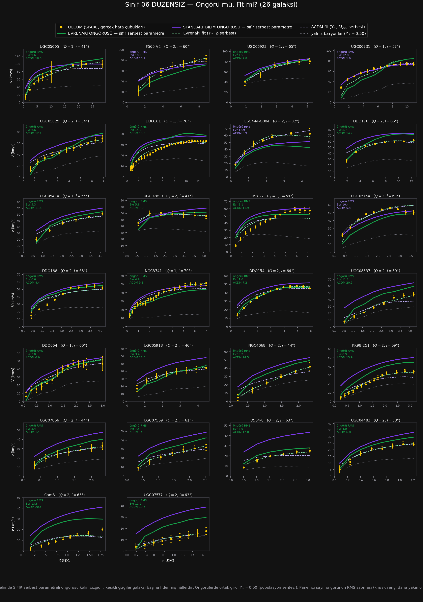

# Sınıf 06 — Düzensiz (Im) · Çalışma dosyası

> ### ⚡ NİHAİ KURULUM GÜNCELLEMESİ (1 Ağustos 2026 · karar: [86_NIHAI](../86_NIHAI/CALISMA.md))
>
> Teorinin galaktik denklemi değişti: $v^2=V_{bar}^2+\sqrt{\mathcal{G}M_{kaps}(R)\,a_0}$
> (yerel $\ell_\omega$) ve $a_0=1{,}75\times cH_0/16{,}1$. `HESAP/` altındaki
> `SONUC.csv`, `YONTEM.md`, `ongoru_vs_fit.png` ve `panel.html` **nihai kurulumla yenilendi.**
> Bu sınıfın nihai sayıları: öngörü RMS **8,12 (ΛCDM 11,76)** km/s · dış sapma **+7,9%** ·
> gereken $a_0$ çarpanı **×0,65** · öngörü yarışı **22/26**.
>
> Aşağıdaki metin ve tablolar **eski (A) kurulumun tarihsel kaydıdır** — silinmedi;
> güncel sayılar için `HESAP/` ve [toplu defter](../_HESAPLAR/toplu_defter.csv).

**26 galaksi · SPARC $T=10$ · $Q{=}1$: 7, $Q{=}2$: 19 · $V_{max}$ 18–100 km/s (medyan 53)
· nokta/galaksi 6–31 (medyan **8**)**

Hesap: `../../sinif_ongoru_vs_fit.py 06_duzensiz` · Çapraz tanı: `../../sinif_capraz_tani.py`
Çıktılar: [`HESAP/SONUC.csv`](HESAP/SONUC.csv) · [`HESAP/YONTEM.md`](HESAP/YONTEM.md) · [`HESAP/ongoru_vs_fit.png`](HESAP/ongoru_vs_fit.png) · [`HESAP/panel.html`](HESAP/panel.html)

---

## 1. Sonuç tablosu (26 galaksinin medyanı)

| Model | $k$ | RMS (km/s) | $\chi^2_{ind}$ | Hata çubuğu içinde |
|---|---|---|---|---|
| Yalnız baryonlar ($\Upsilon_*=0{,}50$) | 0 | 22,28 | 30,68 | %0 |
| Standart bilim ÖNGÖRÜSÜ | 0 | 11,76 | 22,18 | **%0** |
| **Evrenakı ÖNGÖRÜSÜ** | **0** | **7,67** | **5,73** | **%24** |
| ΛCDM fit | 2 | 4,38 | 3,17 | %44 |
| **Evrenakı fit** | 2 | **2,46** | **0,60** | **%87** |

Öngörü yarışı: **Evrenakı 17 / 26** ($+1{,}6\sigma$).

---

## 2. Bu sınıf teorinin lehine — ve deseni kırıyor

Evrenakı hem öngörüde hem fitte önde, üç ölçütün üçünde de:

- **Öngörü:** RMS 7,67'ye karşı 11,76 · $\chi^2_{ind}$ 5,73'e karşı 22,18 (3,9 kat) · hata çubuğu
  içinde **%24'e karşı %0**. Standart bilimin öngörüsü bu sınıfta **hiçbir noktayı** hata çubuğu
  içine sokamıyor; sapması $+16{,}8\%$ ve 26 galaksinin 22'sinde üstte.
- **Fit:** RMS 2,46 · $\chi^2_{ind}$ **0,60** · hata içinde **%87**. Altı sınıfın en iyi değerleri.

Ve teorinin eksik itimi bu sınıfta **en zayıf**: $-6{,}2\%$, yalnız 16/26 galakside altta (%62).
Gereken $a_0$ çarpanı **×1,47** — altı sınıfın en küçüğü.
(⛔ ilk sürümde ×1,29 yazıyordu; naif $10^{-4\Delta}$ formülüyle. Düzeltme kaydı md. 6.)

---

## 3. Ama bu, sınıf 04 ve 05'te verdiğim teşhisi çürütüyor

Sınıf 04'te şunu yazmıştım: *"eksik itim ışıma ve gaz kesri ekseninde; düşük ışımalı, gaz-baskın
galakside büyüyor"* ($r=+0{,}54$). Sınıf 05'te de tekrarlamıştım ($r=+0{,}44$).

**Im eklenince korelasyon çöktü:**

| Değişken | 5 sınıfla | **6 sınıfla** |
|---|---|---|
| $\log L_{3,6}$ | $+0{,}44$ | $\mathbf{+0{,}05}$ |
| gaz kesri | $-0{,}39$ | $\mathbf{-0{,}18}$ |
| $\log V_{max}$ | $+0{,}25$ | $-0{,}17$ |

Sebep tabloda görünüyor:

| Sınıf | medyan $L_{3,6}$ | medyan $V_{max}$ | Evrenakı sapması | $a_0$ çarpanı |
|---|---|---|---|---|
| Sa–Sab | 118,9 | 255 | $-10{,}9\%$ | **×2,67** |
| Sb–Sbc | 107,3 | 216 | $-6{,}2\%$ | **×1,69** |
| Sc–Scd | 21,8 | 141 | $-13{,}6\%$ | **×2,33** |
| **Sd** | 3,4 | 98 | $\mathbf{-22{,}8\%}$ | **×3,76** |
| Sdm–Sm | 1,7 | 82 | $-16{,}6\%$ | **×2,84** |
| **Im** | **0,19** | **53** | $\mathbf{-6{,}2\%}$ | **×1,47** |

Işıma 600 kat düşerken sapma düzgün gitmiyor: **Sd'de tepe yapıp iki yana da düşüyor.**
En düşük ışımalı sınıf (Im, $L_{3,6}=0{,}19$) en küçük sapmayı veriyor — teşhisin öngördüğünün
tam tersi.

> **Geri çekiyorum:** *"eksik itim ışıma/gaz kesriyle ölçekleniyor"* teşhisi **eksik örneklemin
> eseriydi.** Altı sınıfla en güçlü korelasyon $r=-0{,}18$'dir, yani sınanan beş değişkenin
> hiçbiri sapmayı açıklamıyor. **Sınıflar arasında fark var ama tek bir sürekli değişkenle
> açıklanmıyor — teşhis konulamadı.**

Betiğin sonuç cümlesini de bu duruma göre konuşacak hâle getirdim; artık korelasyonun gücünü
kendisi değerlendiriyor ve örnekleme duyarlılığını uyarı olarak basıyor.

---

## 4. Im'in "kazanması" nasıl okunmalı — dört çekince

**(a) Nokta sayısı çok az.** Galaksi başına medyan **8** nokta (6–31). Evrenakı fitinde
$\chi^2_{ind}=0{,}60$ ve $N-k=6$: model, hata çubuklarından **daha iyi** uyuyor. Bu, aşırı-uyum
belirtisidir; iki parametreyle sekiz noktaya uydurmak kolaydır.

**(b) Kalite en düşük sınıf.** $Q=2$: 19/26 (%73). Diğer sınıflarda bu oran %13–30 arasıydı.

**(c) $\Upsilon_*$ ihlali burada da var — ve simetrik.** Fitlenen medyan değerler:

| | $\Upsilon_*$ | Banda ($0{,}3$–$0{,}8$) göre | Bant dışı |
|---|---|---|---|
| Evrenakı | 1,21 | 1,5 kat yüksek | %81 |
| ΛCDM | **0,05** | **6 kat düşük** | **%92** |

Yani Evrenakı'nın $\chi^2_{ind}=0{,}60$'ı da fotometrik olarak kabul edilebilir bir girdiyle elde
edilmemiş. Sınıf 05'in simetri bulgusu burada da geçerli, hatta daha keskin.

**(d) Öngörü galibiyeti $+1{,}6\sigma$.** Anlamlılık eşiğinin altında.

---

## 5. Altı sınıflık nihai tablo

| Sınıf | $n$ | Öngörü RMS E/L | Fit $\chi^2$ E/L | Öngörü oyu | $a_0$ çarpanı |
|---|---|---|---|---|---|
| Sa–Sab | 12 | **27,7** / 30,7 | 4,78 / **3,50** | 7/12 $+0{,}6\sigma$ | ×2,67 |
| Sb–Sbc | 29 | **25,4** / 33,4 | 2,10 / **1,82** | 15/29 $+0{,}2\sigma$ | ×1,69 |
| Sc–Scd | 30 | 21,4 / **13,4** | 2,24 / **2,22** | 13/30 $-0{,}7\sigma$ | ×2,33 |
| Sd | 16 | 20,9 / **7,7** | **1,57** / 1,63 | 0/16 $\mathbf{-4{,}0\sigma}$ | ×3,76 |
| Sdm–Sm | 28 | 18,1 / **10,0** | **1,19** / 2,28 | 8/28 $-2{,}3\sigma$ | ×2,84 |
| **Im** | 26 | **7,7** / 11,8 | **0,60** / 3,17 | 17/26 $+1{,}6\sigma$ | ×1,47 |

**Ne çıkıyor:**

1. **Öngörü:** 3 sınıfta Evrenakı önde, 3 sınıfta ΛCDM. Ama anlamlılıklar asimetrik — ΛCDM'in
   Sd'deki $-4{,}0\sigma$'sı tablodaki en güçlü tek sonuç; Evrenakı'nın en güçlüsü $+1{,}6\sigma$.
2. **Fit:** 3 sınıfta ΛCDM (erken tipler), 3 sınıfta Evrenakı (geç tipler). Tam ters çapraz.
3. **$a_0$ çarpanı düzgün gitmiyor** (1,47–3,76, Sd'de tepe). Yani tek sabit düzeltme yetmez, ama
   hangi ölçekleme gerektiği de bilinmiyor. Düzeltilmiş sayılarla **saçılma büyüdü**
   (2,2 kat → 2,6 kat), yani bu açık kalem ilk sanıldığından **daha ağırdır.**
4. **Bütün fit karşılaştırmaları $\Upsilon_*$ ihlali altında yapıldı** — geç tiplerde her iki model
   de bandın dışında, zıt yönde.

**Genel kazanan yok.** Ve altı sınıfın hiçbirinde "bu model doğruyu öngörüyor" denebilecek bir
sonuç yok: en iyi öngörü hata-çubuğu-içi oranı %38 (ΛCDM, Sd), fitlerde bu %87'ye çıkıyor.

---

## 6. Dürüstlük kayıtları

1. Bu sınıfın bütün sonuçları madde 4'ün dört çekincesiyle birlikte okunmalıdır.
2. **Sınıf 04 ve 05'in korelasyon teşhisi geri çekilmiştir** (madde 3). O iki dosyada teşhis
   olduğu gibi duruyor; buradaki çürütmeye atıf düşülmelidir.
3. Önceki beş sınıfın bütün kayıtları geçerli: $a_0$ kalibre ve $\pm$%40 kararsız, $\Upsilon_*=0{,}50$
   bandın orta değeri, $D$ ve $i$ sabit, hata korelasyonu yok sayıldı.

---

## 7. Çalışmanın tamamından çıkan iş sırası

| # | İş | Neden |
|---|---|---|
| 1 | **Her iki modeli $\Upsilon_*$ bandına hapsedip altı sınıfı tekrarla** | bütün fit hükümleri bu olmadan geçersiz; iki taraf da bandı ihlal ediyor |
| 2 | $D$ ve $i$'yi önselli serbest bırak | standart pratik; sapmaların ne kadarı bunlardan bilinmiyor |
| 3 | Hata korelasyonunu taşı | uzaklık/eğiklik tüm eğriyi birlikte ölçekler; $\chi^2$ şu an şişkin |
| 4 | Im'de nokta sayısı kısıtı ($N\geq12$) ile tekrarla | $\chi^2=0{,}60$ aşırı-uyum şüphesi |
| 5 | Kodu yayınlanmış SPARC NFW fitleriyle doğrula | ΛCDM tarafı tamamen bizim implementasyonumuz |
| 6 | $a_0$ çarpanının neden Sd'de tepe yaptığını araştır | teşhis konulamadı; tek somut açık kalem bu |

**Madde 1 ve 5 en kritik.** Birincisi olmadan altı sınıfın fit karşılaştırmaları fiziksel anlam
taşımıyor; ikincisi olmadan karşılaştırmanın ΛCDM tarafı denetlenmemiş durumda.

**Altı sınıf bitti.** Toplam 141 galaksi sınıflandırıldı, 32'si karmaşık ilan edildi.
