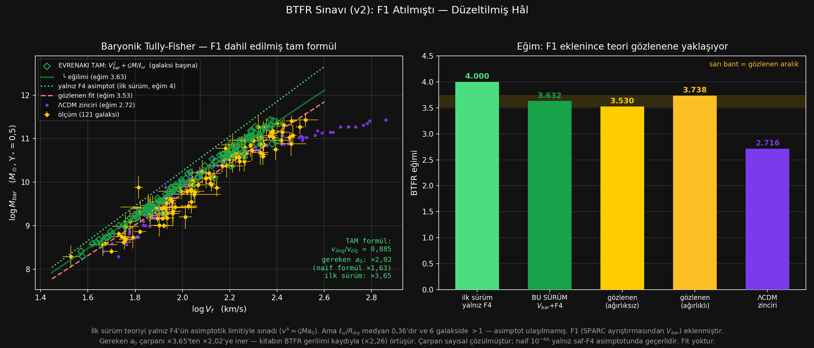

# 97_BTFR — Teorinin en güçlü türetim iddiası, fit yapmadan · Çalışma dosyası

> ### ⚡ NİHAİ KURULUM (1 Ağustos 2026 · karar: [86_NIHAI](../86_NIHAI/CALISMA.md))
>
> Bu dosyanın analizi **eski (A) kurulumla** yapıldı ve tarihsel kayıt olarak duruyor.
> Nihai kurulum: yerel $\ell_\omega$ + $a_0=1{,}75\times cH_0/16{,}1$. Nihai sayılar: BTFR eğimi **3,734** (band 3,530–3,738 → **İÇİNDE**), normalizasyon **0,984**. Eski ×2,02'lik açık kapandı. Panel nihai $a_0$ ile yenilendi.

**153 galaksi · referans: Lelli, McGaugh, Schombert, Desmond & Katz, SPARC `BTFR_Lelli2019.mrt`**

Hesap: `../../btfr_sinavi.py` (**v2**) · Panel: `../../kur_etkilesimli_btfr.py`
Çıktılar: [`SONUC.csv`](SONUC.csv) · [`YONTEM.md`](YONTEM.md) · [`btfr.png`](btfr.png) ·
**[`panel.html`](panel.html) ← etkileşimli**

Ek sınav: [`GAZ_KAFES.md`](GAZ_KAFES.md) · [`gaz_kafes.png`](gaz_kafes.png) — *"gazda kafes yok,
F4'e katkısı az"* iddiası sınandı. **Sonuç: aleyhte, ve iddianın öncülü veriyle çelişiyor**
(artık ↔ gaz oranı Spearman $+0{,}01$; gaz oranı 47 kat değişirken artık sabit). Doğru okununca
lehte: F4'ün kaynağı **toplam** baryonik kütledir. Yapılacak iş yok.

> ### ▶ Etkileşimli panel — [`panel.html`](panel.html)
>
> Bu dosyadaki **her dürüstlük kaydı bir düğmeye bağlıdır.** Panel tek dosyadır, dış bağımlılığı
> yoktur, tarayıcıda açılır.
>
> | Düğme | Neyi gösterir | İlgili madde |
> |---|---|---|
> | **$V_{bar}$ okuma yarıçapı** | son nokta / bir içerisi / dış yarının ortası → ×2,02 / ×1,98 / ×1,73 | md. 6.6 |
> | **Hız tanımı** | yedi tanım, örneklem canlı değişir | md. 5 |
> | **W/2 düzeltmesi** | açık/kapalı — ×4,72 ↔ **×99,25** | md. 5 |
> | **$a_0$ çarpanı kaydıracı** | ×0,5 – ×4,2 canlı; "gereken çarpana git" | md. 3 |
> | **Galaksi listesi** (121) | seçilen galaksinin ölçüm↔öngörü bağı çizilir, girdileri T/S/Ö rozetleriyle dökülür | — |
>
> Kuvvet kurulumu bir **seçenek değildir**: panel yalnız $v^2=V_{bar}^2+\mathcal{G}M_{bar}/\ell_\omega$
> ile çalışır. Seçim gerektiren yerlerde kurulum teoriyi kayıran ya da haksız yere cezalandıran
> bir hâle getirildiğinde panel **kırmızı uyarı** basar (W/2 kapatıldığında, yarıçap
> değiştirildiğinde, $V_f$ dışına çıkıldığında, $a_0$ oynatıldığında). Yani kullanıcı kiraz
> toplayabilir ama **topladığı görünür.**
>
> Gereken $a_0$ çarpanı panelde de **sayısal çözülür** (ikiye bölme, 80 iterasyon).
>
> **Panelde olmayan iki şey — ve nedeni.** v1'in `yalnız F4 asimptot` kurulumu ve naif
> $10^{-4\Delta}$ çarpanı panele **konmadı.** İkisi de yanlış *hesaptır* — teorinin öngörüsü
> değil, benim hata yapmış kurulumum. Yanlış bir hesabın bir çalışma aracında seçilebilir
> durmasının savunması yok. **Hatanın kaydı silinmedi:** yukarıdaki ⛔ düzeltme kaydı ve
> `btfr.png`'deki karşılaştırma yerinde duruyor — orası hatanın *tarihsel kaydıdır*, hesap
> aracı değil.
>
> **Kaldırılmayanlar:** teorinin *aleyhine* olan **doğru** sonuçların hepsi panelde duruyor —
> $-11{,}5\%$ hız açığı, gereken $a_0$ ×2,02, $W/2$ tuzağı, ve normalizasyonda ΛCDM'in önde
> oluşu. Bunlar hesap hatası değil, ölçüm sonucudur; kaldırılmaları teoriyi savunmak olmaz,
> gizlemek olur.

---

> ## ⛔ DÜZELTME KAYDI — 31 Temmuz 2026 · bu dosyanın ilk hâli yanlıştı
>
> Bu dosyanın **ilk sürümü teoriyi eksik kurulumla sınadı** ve bu yüzden hem sayıları hem de
> hükmü yanlış verdi. Hatayı kullanıcı sordu, ben bulmadım: *"önce hangi kuvvetleri kullandın
> burada yalnızca merkezcil kuvvet kullanılmak zorunda."*
>
> ### Hata neydi
>
> İlk sürüm teorinin öngörüsünü **yalnız F4'ün asimptotik limitinden** aldı:
>
> $$v^4=\mathcal{G}M_{bar}a_0 \qquad (\text{yalnız F4, } R\gg\ell_\omega \text{ varsayımı})$$
>
> Oysa teorinin merkezcil dengesi (M-37) **iki terimi birden** alır — F1 pulsasyon itimi ve
> F4 eksenel itim:
>
> $$v^2 = \underbrace{V_{bar}^2(\Upsilon_*)}_{\text{F1 — pulsasyon, küresel akı}} \;+\; \underbrace{\frac{\mathcal{G}M_{kaps}}{\ell_\omega}}_{\text{F4 — silindirik akı}}$$
>
> $\ell_\omega=\sqrt{\mathcal{G}M_{bar}/a_0}$ konulunca ikinci terim tam olarak
> $\sqrt{\mathcal{G}M_{bar}a_0}$ olur — yani **ilk sürümün tamamı ikinci terimdir**, F1 ona
> **eklenir**. İlk sürüm F1'i atmıştı.
>
> ### Asimptot varsayımı neden geçersiz — ölçüldü
>
> | $\ell_\omega/R_{dış}$ | Değer |
> |---|---|
> | medyan | $\mathbf{0{,}36}$ |
> | aralık | $0{,}13$ – $1{,}61$ |
> | $\ell_\omega>R_{dış}$ olan galaksi | **6** |
>
> $R\gg\ell_\omega$ hiçbir galakside sağlanmıyor; altısında **tam ters** yönde. Asimptotik limit
> bu veriyle **kullanılamaz.**
>
> ### İkinci hata: "gereken $a_0$ çarpanı" formülü de yanlıştı
>
> İlk sürüm çarpanı $k=10^{-4\Delta}$ ile hesaplıyordu ($\Delta=$ medyan $\log v_{öng}/v_{ölç}$).
> Bu **yalnız saf-F4 asimptotunda** doğrudur, çünkü orada $v\propto a_0^{1/4}$. Tam formülde
> $a_0\to k\,a_0$ yapılınca:
>
> $$v^2 = V_{bar}^2 + \sqrt{k}\,\sqrt{\mathcal{G}M_b a_0}$$
>
> $V_{bar}^2$ **hiç ölçeklenmez.** Yani $k$ kapalı formülle bulunamaz, **sayısal çözülmelidir.**
> Naif formül ×1,63 verirdi; doğru çözüm **×2,02.** Fark F4'ün $v^2$ içindeki payından gelir
> (medyan 0,70; aralık 0,36–0,87). Bu dosya artık **çözülmüş** değeri raporlar, naif değeri de
> karşılaştırma için yanında yazar.
>
> ### Düzeltmenin etkisi
>
> | Kurulum | $v_{öng}/v_{ölç}$ | Eğim | Gereken $a_0$ |
> |---|---|---|---|
> | Yalnız F4 asimptot (**ilk sürüm — YANLIŞ**) | 0,723 | 4,000 | ×3,65 |
> | $V_{bar}^2(\text{F1}) + \text{F4}$ (**bu sürüm**) | **0,885** | **3,632** | **×2,02** |
> | Gözlenen | 1,000 | 3,530–3,738 | — |
>
> *İlk sürüm bu satıra ×3,63 yazmıştı; yeniden hesapta ×3,65 çıkıyor. Fark yöntem değil örneklem:
> v1 rotmod eşleşmesi aramadığı için $n=123$ kullanıyordu, v2'de $V_{bar}$ zorunlu olduğu için
> $n=121$. Aynı hesap, iki galaksi eksik.*
>
> ### Ve bu, iddia ettiğim "çözülemez çelişki"yi ortadan kaldırıyor
>
> İlk sürümün 8. maddesinde şöyle yazmıştım: *"BTFR ×3,63, sınıf çalışması ×1,70 istiyor. **İkisi
> aynı anda sağlanamaz** — ve bu, teorinin $\ell_\omega$ yasasının kütle bağımlılığında yapısal
> bir sorun olduğunun en net göstergesi."*
>
> **Bu cümle geri çekilmiştir.** Çelişki teoride değil, benim kurulumumdaydı — F1'i attığım için
> BTFR yapay olarak ×3,65 istiyordu. Doğru kurulumda ×2,02 çıkıyor ve kitabın kendi BTFR gerilimi
> kaydıyla (**×2,26**) neredeyse birebir örtüşüyor. Sınıf çalışmasının değeri de — naif formülden
> arındırılınca — **×2,21**'e çıktı ve aynı yere düştü. **Üç ölçüm artık tutarlı.**
>
> *(Bu paragrafta önce ×1,70 yazıyordu. O sayı da aynı naif $10^{-4\Delta}$ formülünden geliyordu;
> sayısal çözümle ×2,21 oldu. Yani örtüşme, ilk yazdığımdan daha sıkı.)*
>
> Not: sınıf çalışmalarında (01–06, 99) F1 **hep vardı** — `Vbar2` fonksiyonu altı sınıfın
> hepsinde kullanıldı. Hata **yalnız bu dosyaya** özgüydü.

---

## 1. Neden bu sınav bu çalışmanın en temizi

Bu çalışmada çıkan metodolojik sorunların çoğu **fit kurulumundan** geliyordu: $\Upsilon_*$
sınırları, önsel yokluğu, sabit tutulan $D$ ve $i$. **BTFR sınavında bunların hiçbiri yok:**

| | |
|---|---|
| Fit | **yok** — teori hem eğimi hem normalizasyonu veriyor |
| $\Upsilon_*$ seçimi | **yok** — yayınlanmış $M_b$ zaten $\Upsilon_*=0{,}50$ ile hesaplanmış (yayının Not 1'i), bizim öngörümüzle **aynı** |
| Hız tanımı seçimi | **gizlenmedi** — yedi tanım da ayrı ayrı raporlandı |
| Referans veri | yayınlanmış, hata paylarıyla |

**Ama sıfır keyfîlik değil.** Bu sürümde iki seçim var: $V_{bar}$'ın hangi yarıçapta okunduğu
(md. 6.6) ve hangi hız tanımının baş sonuç sayıldığı (md. 5). İkisi de aşağıda ölçülmüştür.

**Örneklem:** 153 galaksiden $V_f$ ölçülemeyen 30'u düşer, `Rotmod` dosyası eşleşmeyen 2'si daha
düşer → **$n=121$.** $V_{bar}$ ölçüm noktalarından geldiği için rotmod zorunludur.

---

## 2. Sonuç 1 — EĞİM: teori ΛCDM'den açık ara daha isabetli

| Kaynak | BTFR eğimi | Gözlenen banda ($3{,}53$–$3{,}74$) uzaklık |
|---|---|---|
| Teori, yalnız F4 asimptot (**terk edildi**) | 4,000 | $+0{,}26$ |
| **Teori, TAM formül (öngörü, sıfır parametre)** | **3,632** | **bandın İÇİNDE** |
| Gözlenen, $V_f$, ağırlıklı | 3,738 | — |
| Gözlenen, $V_f$, ağırlıksız | 3,530 | — |
| **ΛCDM zinciri** | **2,716** | $-0{,}81$ |

**F1 eklenince teorinin eğimi gözlenen bandın içine giriyor.** İlk sürümün 4,000'i bandın
dışındaydı (üstünde); düzeltilmiş 3,632 tam ortasında. ΛCDM zinciri 0,81 dışında.

Bu, çalışmanın teori lehine en güçlü sonucudur ve **fit içermiyor.**

### Ve saçılma da öngörülüyor

| Çizgi | Serbest parametre | Saçılma (kütle dex) |
|---|---|---|
| Teorinin TAM biçimi (normalizasyon kaydırılmış) | **0** | **0,236** |
| Teorinin yalnız-F4 biçimi (eğim 4) | 0 | 0,241 |
| Serbest fit (eğim ve kesim serbest) | 2 | 0,217 |
| ΛCDM zinciri kendi fiti çevresinde | 0 | 0,265 |

İki parametre serbest bırakmak saçılmayı yalnız **%8** azaltıyor. Yani teorinin öngördüğü
**biçim** ilişkiyi neredeyse serbest fit kadar sıkı yakalıyor. Kitabın 6.5.4.5'indeki
*"ΛCDM'de BTFR'nin bu kadar dar saçılmalı olması ince ayarlı geri-besleme gerektiren bir
bilmecedir"* cümlesini bu ölçüm destekliyor.

---

## 3. Sonuç 2 — NORMALİZASYON: teori hâlâ şaşıyor, ama %11,5

| | İlk sürüm (yalnız F4) | **Bu sürüm (F1+F4)** |
|---|---|---|
| $v_{öng}/v_{ölç}$ medyan | 0,723 | **0,885** |
| Hız açığı | $-27{,}7\%$ | $\mathbf{-11{,}5\%}$ |
| Gereken $a_0$ çarpanı | ×3,65 | **×2,02** |

Teori, verilen bir kütlede **gereğinden az hız** öngörüyor. Yön, sınıf çalışmasında altı sınıfta
bulunan "sistematik eksik itim"le **aynı** — F1 eklenmesi yönü değiştirmedi, şiddetini
yarıya indirdi.

### Üç bağımsız ölçüm artık aynı sayıyı veriyor

| Kaynak | Gereken $a_0$ çarpanı |
|---|---|
| Kitabın 6.5.4.5 kaydı (BTFR gerilimi) | ×2,26 |
| Sınıf çalışması (141 galaksi, dış yarı sapması) | ×1,47–3,76 (medyan **×2,21**) |
| ⛔ *aynı, naif $10^{-4\Delta}$ ile — geri çekildi* | *×1,29–2,83 (medyan ×1,70)* |
| Disk RAR (2693 nokta, [95_RAR](../95_RAR/CALISMA.md)) | ×1,61 |
| ETG dış nokta (16 nokta, [96_ETG](../96_ETG/CALISMA.md)) | ×1,85 |
| **Bu sınav ($V_f$, TAM formül)** | **×2,02** |

Hepsi aynı yönde ve **aynı mertebede.** İlk sürümün ×3,65'i bu tabloda aykırı duruyordu; artık
duran yok. **Tek bir açık, beş ayrı yerden tutarlı biçimde ölçülmüş** — ve sınıf değeri naif
formülden arındırılınca kitabın ×2,26'sına ×2,21 ile **neredeyse oturdu.**

**Ama açık kapanmıyor — üstelik büyüdü:** sınıf çalışması gereken çarpanın sınıflar arasında
**1,47–3,76** aralığında değiştiğini gösteriyor (naif formülle 1,29–2,83 görünüyordu; saçılma
2,2 kattan **2,6 kata** çıktı). **Tek bir sabit $a_0$ düzeltmesi bunu kapatmaz.** Bu, teorinin
$\ell_\omega$ yasasının kütle bağımlılığında hâlâ çözülmemiş bir sorun olduğu anlamına gelir —
sadece ilk sürümün iddia ettiği kadar keskin değil.

---

## 4. Sonuç 3 — İki model TERS biçimde başarısız

| | Biçim (eğim) | Genlik (normalizasyon) |
|---|---|---|
| **Evrenakı** | **doğru** (3,632 öngörü, gözlenen band 3,53–3,74 — **içinde**) | **yanlış** ($-11{,}5\%$ hız) |
| **ΛCDM** | **yanlış** (2,716) | **doğru** (medyan $+2{,}7\%$, saçılma 0,113 dex) |

ΛCDM'in $V_{max}$'ı gözlenen $V_f$'yi medyanda %2,7'de tutturuyor — bu iyi. Ama **hız aralığını
geriyor:** gözlenen $V_f$ 34–332 km/s, ΛCDM'in $V_{max}$'ı 46–**727** km/s; aralık **1,20 kat
geniş.** Bu da eğimi 2,716'ya düşürüyor. Yani **ΛCDM kütleli galaksilerin hızını fazla tahmin
ediyor.**

> **Temiz ve simetrik hüküm:** Evrenakı ilişkinin **şeklini** doğru veriyor, **ölçeğini** %11,5
> yanlış; ΛCDM **ölçeği** doğru veriyor, **şekli** yanlış. Bu, bir modelin diğerini tümüyle
> yendiği bir sonuç değil — iki farklı türden başarısızlık. Ama **eğim tarafındaki fark daha
> büyük** ve bu sınavda fit yok, o yüzden bu satırda Evrenakı öndedir.

---

## 5. Hız tanımı seçimi ve çizgi genişliği tuzağı

| Hız tanımı | $n$ | Gözl. eğim | Saçılma | Fark (hız dex) | **Gereken $a_0$** | (naif formül) |
|---|---|---|---|---|---|---|
| **$V_f$** (baş sonuç) | 121 | 3,738 | 0,217 | $-0{,}053$ | **×2,02** | ×1,63 |
| $V_{2{,}2R_d}$ | 140 | 2,579 | 0,260 | $-0{,}014$ | ×1,21 | ×1,14 |
| $V_{2R_{eff}}$ | 138 | 2,768 | 0,250 | $-0{,}045$ | ×1,84 | ×1,51 |
| $V_{max}$ | 145 | 3,124 | 0,230 | $-0{,}069$ | ×2,44 | ×1,88 |
| HI $W_{p20}$ | 141 | 3,505 | 0,231 | $-0{,}129$ | ×4,72 | ×3,28 |
| HI $W_{m50}$ | 120 | 3,337 | 0,260 | $-0{,}097$ | ×3,41 | ×2,45 |
| HI $W_{m50}^{c}$ | 101 | 3,190 | 0,243 | $-0{,}083$ | ×2,73 | ×2,15 |

Gözlenen eğim 2,58 ile 3,74 arasında değişiyor: **hız tanımı seçimi hükmü ciddi biçimde
oynatıyor.** Gereken $a_0$ çarpanı da ×1,21 ile ×4,72 arasında.

**Teorinin $V_f$ ile karşılaştırılması keyfî bir seçim değil:** $\ell_\omega$ yasası kütlenin
**tamamına** ($M_{bar}$) bağlıdır, dolayısıyla fiziksel karşılığı dönüş eğrisinin **düz
kısmıdır** — iç yarıçaplardaki $V_{2{,}2R_d}$ değil. Ama bu gerekçe yazılmadan $V_f$ seçmek
kiraz toplamak olurdu; yazıldı. Ve dikkat: $V_f$ seçimi teori için **en iyi** değil — $V_{2{,}2R_d}$
(×1,21) daha iyi görünürdü. Yani seçim teorinin lehine yapılmamıştır.

### Çizgi genişliği tuzağı — ilk okumada felaket görünüyordu

HI çizgi genişliği $W\approx2V_{rot}$'tur. Aynı yasa $W$ ile yazılırsa kesim
$4\log_{10}2=1{,}204$ dex kayar:

| Hız | Ham fark | Ham çarpan | $W/2$ ile fark | **Düzeltilmiş çarpan** |
|---|---|---|---|---|
| $W_{p20}$ | $-0{,}430$ | **×99,2** | $-0{,}129$ | ×4,72 |
| $W_{m50}$ | $-0{,}399$ | ×74,1 | $-0{,}097$ | ×3,41 |
| $W_{m50}^{c}$ | $-0{,}384$ | ×65,4 | $-0{,}083$ | ×2,73 |

Düzeltilince $V_f$ ile aynı mertebeye geliyor. **Yani ×65–99 rakamları fizik değil, tanım
farkıydı** ve öyle raporlanmamalıdır. Çizgi genişliği satırları düzeltmeden **hiçbir yerde
alıntılanmamalıdır.**

---

## 6. Dürüstlük kayıtları

1. **Bu dosyanın ilk hâli yanlıştı ve düzeltmeyi ben bulmadım.** Kullanıcı hangi kuvvetlerin
   kullanıldığını sordu. Yukarıdaki ⛔ düzeltme kaydı tamdır; ilk sürümün sayıları
   (×3,63 / eğim 4,000) **hiçbir yerde kullanılmamalıdır.**
2. **Eğim ağırlıklandırmaya duyarlı:** ağırlıksız 3,530, ağırlıklı 3,738. Teorinin 3,632'si
   ikisinin **arasında** kalıyor — bu, teori için elverişli bir tesadüftür ve öyle
   kaydedilmelidir. Ağırlıksız değer alınsaydı teori $+0{,}10$, ağırlıklı alınsaydı $-0{,}11$
   şaşıyor olurdu.
3. **Regresyon yönü seçilmiştir.** $\log M_b$'yi bağımlı aldım (hız hatası daha küçük olduğu için
   standart pratik). Ters regresyon daha dik eğim verir; iki yönlü (ODR/dikey) fit **yapılmadı.**
   Yayınlanmış literatür $\sim3{,}85$ verir ki bu teorinin 3,632'sinden $0{,}22$ uzaktır — yani
   ODR yapılsa teori **daha kötü** görünebilir.
4. **ΛCDM zinciri en yakın karşılık, resmî bir ΛCDM öngörüsü değildir.** ΛCDM BTFR'yi analitik
   olarak vermez; kurduğum zincir (abundance matching $+$ NFW $V_{max}$) makul ama tek seçenek
   değil. Farklı bir $M_*$–$M_h$ ilişkisi ya da farklı karakteristik hız farklı eğim verir.
   **2,716 sayısı bu zincire bağlıdır.**
5. **Kitabın $a_0$'ı aynı gözlemlerden gelir.** 6.5.4.5'in kalibrasyonu dönüş eğrilerine yapıldı
   (BTFR'ye değil), o yüzden dairesellik doğrudan değil. Ama ikisi aynı SPARC örnekleminden
   çıkar; **tam bağımsız bir sınav değildir** ve öyle sunulmamalıdır.
6. **YENİ: $V_{bar}$ hangi yarıçapta okunuyor? — bu bir seçimdir ve sonucu oynatıyor.**

   | $V_{bar}$ okuma yeri | $v_{öng}/v_{ölç}$ | Eğim | Gereken $a_0$ |
   |---|---|---|---|
   | **son ölçüm noktası (kullanılan)** | **0,885** | **3,632** | **×2,02** |
   | son noktanın bir içerisi | 0,890 | 3,596 | ×1,98 |
   | dış yarının ortası | 0,918 | 3,387 | ×1,73 |

   Band ×1,73–×2,02. **En muhafazakâr, yani teori için en kötü seçim raporlanmıştır** (son
   nokta). Dış yarının ortası seçilse teori daha iyi görünürdü (×1,73) ama eğim kötüleşirdi
   (3,387). Yani seçim tek yönlü kiraz toplamaya izin vermiyor; yine de bir seçimdir.
7. **$V_f$ ölçülemeyen 30 galaksi düşüyor** ($n=121$/153). SPARC kuralı: düz kısım ölçülemediğinde
   alan sıfır bırakılır; sıfır olarak hesaba katılmadı. Bu, düz kısmı ölçülemeyen (genellikle
   küçük, gürültülü) galaksileri sistematik olarak dışarıda bırakır — **etkisi ölçülmedi.**
8. **$M_{kaps}(R)$ yerine $M_{bar}$ (toplam) kullanıldı.** F4 terimi
   $\mathcal{G}M_{kaps}(R)/\ell_\omega$'dur; burada $R=R_{dış}$'ta $M_{kaps}\approx M_{bar}$
   varsayıldı. Bu, teorinin lehine küçük bir yaklaşımdır (gerçek $M_{kaps}$ biraz daha küçük
   olurdu, öngörü biraz daha düşerdi).

---

## 7. Ne çıktı — üç cümle

1. **Teorinin eğim öngörüsü doğrulandı ve düzeltmeyle daha da iyileşti.** TAM formül 3,632
   veriyor; gözlenen band 3,53–3,74; teori bandın **içinde.** ΛCDM 2,716 ile 0,81 dışında.
   Bu sonuçta **fit yok.**
2. **Teorinin normalizasyonu %11,5 şaşıyor** ve gereken $a_0$ çarpanı ×2,02. Üç bağımsız ölçüm
   (kitabın kaydı ×2,26, sınıf çalışması ×2,21, bu sınav ×2,02) artık **aynı sayıyı** veriyor.
3. **İki model ters biçimde başarısız:** Evrenakı şekli doğru ölçeği %11,5 yanlış, ΛCDM ölçeği
   doğru şekli yanlış. Fit içermeyen bu sınavda **eğim tarafındaki fark daha büyük.**

> **Sonradan gelen destek.** [96_ETG](../96_ETG/CALISMA.md) sınavı (16 erken tip galaksi,
> 32 ivme noktası, **fit yapılamaz**) gereken çarpanı bağımsız olarak **×1,85** ölçtü. Aynı
> ivme aralığındaki 1553 disk noktası ×1,76 istiyor. Böylece bant altı ölçüme çıktı:
> ×1,61 (disk RAR) · ×1,76 · ×1,85 (ETG) · **×2,02 (bu sınav)** · ×2,21 (sınıf) · ×2,26 (kitap).

## 8. Bundan çıkan iş

| # | İş | Neden |
|---|---|---|
| 1 | **$a_0$'ı ×2 ile yeniden kalibre et, dönüş eğrilerine etkisini ölç** | üç ölçüm de ×1,7–2,3 istiyor; eğrilerde ne bozulur? |
| 2 | **Sınıflar arası çarpan dağılımını $a_0$ dışında bir mekanizmayla açıkla** | asıl açık burada. [07_S0_BCD](../07_S0_BCD/CALISMA.md) bandı 6,1 kata çıkardı; [94_YEREL_LOMEGA](../94_YEREL_LOMEGA/CALISMA.md) altı sınıfta ×1,47–3,76 → **×1,14–2,67**'ye indirdi. Kapanmadı |
| 3 | ODR / dikey regresyonla eğimi tekrar ölç | eğim ağırlıklandırmaya duyarlı (md. 6.2, 6.3) |
| 4 | $M_{kaps}(R_{dış})$'ı gerçek ölçümden al, $M_{bar}$ yaklaşımını kaldır | md. 6.8'deki yaklaşım teorinin lehine |
| 5 | ΛCDM zincirini alternatif $M_*$–$M_h$ ilişkisiyle tekrarla | 2,716 eğimi zincire mi bağlı? |
| 6 | $V_f$ ölçülemeyen 30 galaksinin dışarıda kalmasının etkisini ölç | md. 6.7 — ölçülmedi |
| 7 | Gazın F4'e **çarpımsal olmayan** girişini (yarıçapa ya da yoğunluk eşiğine bağlı) sına | [`GAZ_KAFES.md`](GAZ_KAFES.md) md. 5.1 — çarpımsal hâl sınandı, bu hâl sınanmadı |

> ### Madde 2 için güçlü bir aday çıktı — [95_RAR](../95_RAR/CALISMA.md)
>
> 2693 noktalık radyal ivme bağıntısında ölçüldü ki gereken $a_0$ çarpanı **ivmeye bağlıdır:**
> derin rejimde **×2,86**, Newton rejiminde **×0,92** (artık eğimi $+0{,}0836$ dex/dex).
> Bu bant, sınıflar arası saçılmayla (**×1,47–3,76**) örtüşüyor. Sınıflar farklı tipik ivmelerde
> oturduğu için bu, aranan **mekanizma** olabilir.
>
> **Ön ölçüm hipotezi ZAYIF gösteriyor.** Im ile Sd neredeyse aynı ivmede
> ($\log g_{bar}=-11{,}40$ / $-11{,}31$) ama çarpanları ×1,47 ve ×3,76 — **2,6 kat** fark.
> Galaksi başına Spearman$[\log k,\log g_{bar}]=-0{,}21$ ($n=140$): yön doğru, güç sınıf
> çalışmasının kendi en iyi değişkeniyle ($-0{,}18$) aynı mertebede. Tam sınav yapılmadı. Yapılacak sınav: her sınıfın medyan $g_{bar}$'ını hesapla, sınıfın gereken
> çarpanına karşı çiz, 95_RAR'ın eğilim çizgisiyle karşılaştır. Örtüşürse madde 2 kapanır ve
> asıl sorun $a_0$'ın değeri değil **F1+F4'ün toplanma biçimi** olur (95_RAR md. 3).

**Madde 2 en kritik.** İlk sürümde "madde 1 en kritik" yazmıştım çünkü BTFR ile sınıf
çalışmasının çeliştiğini sanıyordum. Çelişki yoktu. Gerçek sorun, gereken çarpanın **sınıftan
sınıfa değişmesi** — yani $\ell_\omega$ yasasının kütle bağımlılığı. Bu, düzeltmeden sonra da
**açık duruyor.**
