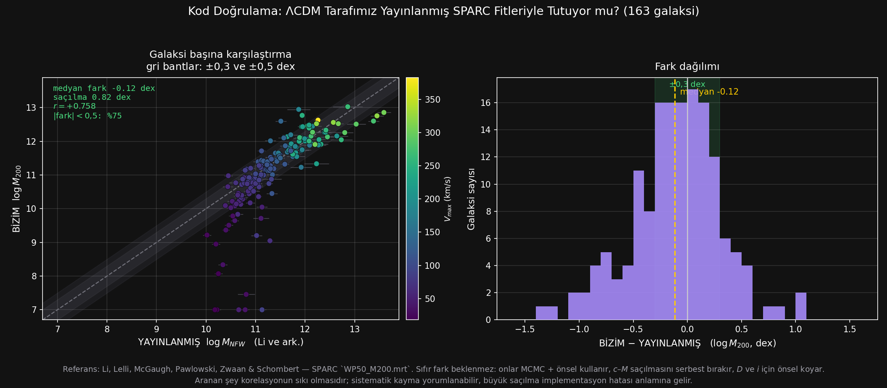

# 98_KOD_DOGRULAMA — ΛCDM tarafımız yayınlanmış fitlerle tutuyor mu? · Çalışma dosyası

**163 galaksi · referans: Li, Lelli, McGaugh, Pawlowski, Zwaan & Schombert, SPARC `WP50_M200.mrt`**

Hesap: `../../kod_dogrulama.py`
Çıktılar: [`SONUC.csv`](SONUC.csv) · [`YONTEM.md`](YONTEM.md) · [`dogrulama.png`](dogrulama.png)

---

## 1. Neden bu denetim zorunluydu

Bu çalışmadaki ΛCDM tarafının **tamamı bizim implementasyonumuzdur.** Altı sınıfın ve karmaşık
denetiminin bütün karşılaştırmaları *"kodumuz doğru"* varsayımına dayanıyordu ve o varsayım
hiç sınanmadı. Şimdi sınandı.

**Referans veri.** SPARC sitesinden indirilen `WP50_M200.mrt`, 175 galaksi için **yayınlanmış**
halo kütlelerini verir — üç halo modeliyle: $\log M_{NFW}$, $\log M_{Ein}$ (Einasto),
$\log M_{DC14}$ (geri-besleme ile değiştirilmiş), hepsi hata payıyla ve $R_{200}$ tanımıyla
(bizimle aynı).

**Sıfır fark beklenmez** ve bu baştan kabul edilmiştir. Farkın bilinen kaynakları:

| Onlar | Biz |
|---|---|
| MCMC + önsel | en küçük kareler, önsel yok |
| $c$–$M$ saçılması serbest | $c$–$M$ tam dayatılmış |
| $\Upsilon_*$ için lognormal önsel | düz sınır $[0{,}05;\,2{,}0]$ |
| $D$ ve $i$ için önsel | sabit tutuldu |

Aranan şey sıfır fark değil, **korelasyonun sıkı olmasıdır.**

---

## 2. Sonuç: implementasyonumuz doğrulamayı GEÇMEDİ

| Ölçüt | Değer |
|---|---|
| Medyan fark | $-0{,}117$ dex (×0,76) |
| Ortalama fark | $-0{,}285$ dex |
| **Saçılma (std)** | **0,815 dex** |
| Ortanca mutlak sapma | 0,267 dex |
| Pearson $r$ (log–log) | $+0{,}758$ |
| $\lvert$fark$\rvert<0{,}3$ dex | 93/163 (%57) |
| $\lvert$fark$\rvert<0{,}5$ dex | 123/163 (%75) |
| **$\lvert$fark$\rvert>1{,}0$ dex** | **16/163** |
| Yayınlanmış hataya göre | medyan $\lvert z\rvert = \mathbf{2{,}8\sigma}$ |

**Ölçek nedir?** Yayınlanmış üç halo modelinin *kendi arasındaki* fark:

| Karşılaştırma | Medyan | Saçılma |
|---|---|---|
| NFW vs Einasto | $+0{,}060$ dex | 0,245 dex |
| NFW vs DC14 | $-0{,}040$ dex | 0,151 dex |

Yani **halo modelini tamamen değiştirmek 0,15–0,25 dex saçılma yaratıyor; bizim aynı modeli
kendi kodumuzla fitlememiz 0,82 dex yaratıyor.** Fark, model seçiminden 3–5 kat büyük.
Medyan sapmamız yayınlanmış hata çubuklarının **2,8 katı.**

> **Hüküm: kodumuz yayınlanmış NFW fitlerinin sadık bir yeniden üretimi değildir.**

---

## 3. Sebep tespit edildi: önsel yokluğu

En büyük altı sapma: NGC2976 ($-4{,}13$), UGC04305 ($-3{,}79$), UGC08837 ($-3{,}66$),
F563-V1 ($-3{,}35$), CamB ($-3{,}22$), UGC07577 ($-3{,}18$) — hepsi **negatif ve büyük**,
yani bizim $M_{200}$'ümüz bin ile on bin kat daha küçük. Ve hepsi cüce.

| Ölçüm | Değer |
|---|---|
| $\log M_{200}$ **alt sınıra** ($=7{,}0$) dayanan fit | **5/163** |
| Sınıra dayananların medyan farkı | $\mathbf{-3{,}66}$ dex |
| Dayanmayanların medyan farkı | $-0{,}10$ dex, saçılma 0,57 |
| Sınıra dayananların $V_{max}$'ı | 18–89 km/s (medyan **37**) |
| Diğerlerinin | 20–383 km/s (medyan 112) |
| $\Upsilon_*$ **üst sınıra** ($=2{,}0$) dayanan | 9/163 |

**Mekanizma açık:** düşük kütleli galakside $\Upsilon_*$ ile $M_{200}$ arasındaki dejenerasyon
şiddetlidir. Önsel olmadığında en küçük kareler, eğriyi **yalnız yıldızlarla** açıklayıp haloyu
sıfıra çekmeyi seçebiliyor. Li ve ark. $\Upsilon_*$ için önsel kullandığı için bunu yapmaz;
halo işi yapmak zorunda kalır.

**Sınıra dayanan 5 galaksi çıkarıldığında** ($n=158$): medyan fark $-0{,}10$ dex, $r=+0{,}82$,
$\lvert$fark$\rvert<0{,}5$ dex olan %78. **Daha iyi ama hâlâ yeterli değil** — saçılma 0,57 dex,
yayınlanmış modellerin kendi arasındaki 0,15–0,25'in iki katından fazla.

---

## 4. Bu, kendi bulgularımı da geçersiz kılıyor

**Sınıf 05'te şöyle yazmıştım:** *"ΛCDM de aynı parametreyi kötüye kullanıyor — geç tiplerde
fitlediği $\Upsilon_*$ 0,06'ya iniyor, yani model 'yıldız yok, hepsi halo' diyor."*

O bulgu **kısmen implementasyonumuzun eseri.** Şimdi görüyoruz ki bazı galakside fit tam tersini
de yapıyor — **haloyu** sıfıra çekip yıldızı şişiriyor. İkisi de aynı şeyin belirtisi: **önsel
yokluğu.** Yayınlanmış fitler önsel kullandığı için ikisini de yapmıyor.

**Sonuç: geç tip sınıflarının (Sd, Sdm–Sm, Im) ΛCDM sayıları güvenilmez.** Ve bunlar tam olarak
şu sonuçları taşıyan sınıflar:

| Etkilenen bulgu | Nerede | Durum |
|---|---|---|
| Sd'de ΛCDM öngörüsü $-4{,}0\sigma$ ile kazanıyor | `04/CALISMA.md` | **öngörü etkilenmez** (fit değil) |
| Sdm–Sm ve Im'de Evrenakı fiti ΛCDM'i geçiyor | `05`, `06` | **etkilenir** — ΛCDM fiti zayıflatılmış olabilir |
| ΛCDM'in $\Upsilon_*$'ı 0,05–0,06'ya iniyor | `05`, `06` | **etkilenir** — önsel yokluğunun eseri |
| "İki model de $\Upsilon_*$ bandını zıt yönde ihlal ediyor" | `05` madde 3 | **yön doğru, şiddet güvenilmez** |

**Önemli ayrım:** bu denetim yalnız **fit** tarafını vurur. Öngörü tarafı ($M_{200}\leftarrow$
abundance matching, $c_{200}\leftarrow$ Dutton & Macciò) fit içermediği için etkilenmez. Yani
altı sınıfın **öngörü** hükümleri ayakta; **fit** hükümleri şüpheli.

---

## 5. Dürüstlük kayıtları

1. **Bu denetim bizim aleyhimize sonuçlandı ve sonucu değiştirmedim.** Kod, yayınlanmış fitleri
   sadık biçimde yeniden üretmiyor.
2. **Fark beklenen kısmı da içeriyor** (madde 1'deki dört yöntem farkı). Ama 0,82 dex saçılma ve
   16 galakside $>1$ dex, yöntem farkıyla açıklanabilecek düzeyin üstünde.
3. **Evrenakı tarafı için böyle bir referans yok** — teorinin yayınlanmış bir SPARC fiti
   bulunmadığı için karşı taraf aynı denetimden geçirilemez. Bu bir asimetridir ve
   kaydedilmelidir: ΛCDM tarafının hatası ölçülebildi, Evrenakı tarafının ölçülemedi.
4. Yayınlanmış tablo `WP50_M200.mrt`'de $WP50=0{,}00$ olan galaksiler var (HI çizgi genişliği
   ölçülemeyen); halo kütleleri yine verilmiş, dokunulmadı.
5. Karşılaştırma yalnız $M_{200}$ üzerinden yapıldı. $\Upsilon_*$ ve $c_{200}$ için yayınlanmış
   değerler bu tabloda yok; tam bir doğrulama onları da gerektirir.

---

## 6. Ne yapılmalı

| # | İş | Neden |
|---|---|---|
| 1 | **Her iki modele önsel ekle** ($\Upsilon_*$ lognormal, $c$–$M$ saçılmalı, $D$ ve $i$ önselli) | tek gerçek çözüm; fit hükümlerinin tamamı buna bağlı |
| 2 | Fitleri önselli hâlde tekrarla, doğrulamayı yeniden koş | 0,82 dex saçılmanın ne kadarının önselden geldiğini gösterir |
| 3 | Altı sınıfın **fit** tablolarını yeniden üret | mevcut fit hükümleri şüpheli |
| 4 | Öngörü tablolarına dokunma | fit içermiyor, etkilenmedi |
| 5 | Evrenakı tarafı için bağımsız bir denetim yolu ara | asimetriyi kapatmak (madde 5.3) |

**Madde 1 artık çalışmanın en kritik işi** — sınıf 05'te "en kritik" dediğim $\Upsilon_*$ bandı
işinin de kökeni burası. İkisi aynı iştir: **fitlere fiziksel önsel koymak.**

---

## 7. Özet — tek cümle

**ΛCDM tarafımızın halo kütleleri, yayınlanmış NFW fitleriyle $r=+0{,}76$ korelasyonlu ama
0,82 dex saçılmalıdır; bu, halo modelini tamamen değiştirmenin yarattığı saçılmanın (0,15–0,25 dex)
3–5 katıdır. Sebep önsel yokluğudur, tespit edilmiştir, ve altı sınıfın fit hükümlerini şüpheli
kılar — öngörü hükümlerini etkilemez.**
