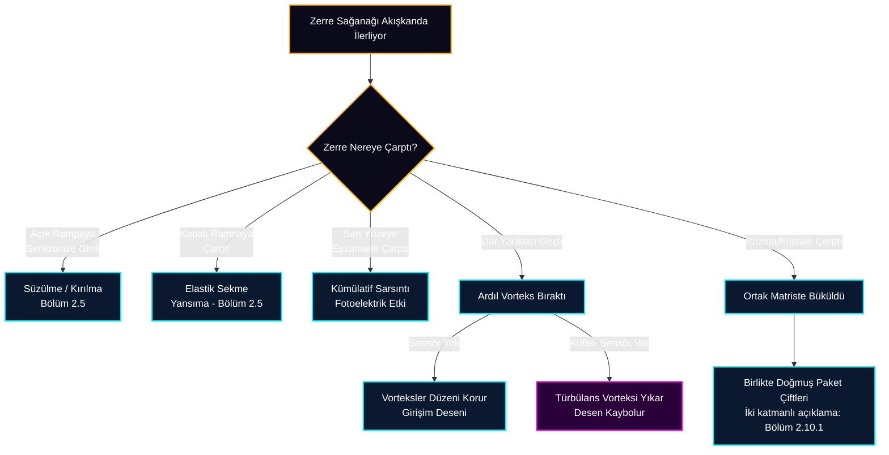

# 2.10 Kuantum Anomalileri ve Sentez

Standart yorum, kuantum olgularını doğanın indirgenemez biçimde olasılıksal olduğu tezine bağlar. Evrenakı Teorisi buna deterministik bir alternatif önerir: gerçeklik olasılıklara dayanmaz; gözlenen istatistikler, içinden geçilen Evrenakı ortamının hidrodinamik kurallarının ve kontrol edilemeyen hazırlık değişkenlerinin izdüşümüdür.

Önceki bölümlerde, standart fiziğin kuantum anomalisi olarak adlandırdığı pek çok olgunun mekanik çözümlerini gördük:
* **Fotoelektrik Etki (Bölüm 2.2):** Kütlesiz enerjinin emilimi değil, mermi gibi kütleli Zerre sağanağının kümülatif rezonans darbesiyle elektronu sökmesidir (tek vuruşun neden yetmediği ve tarihsel sınamalarla uyum için bkz. 2.2.2–2.2.3).
* **Dalga-Parçacık İkiliği ve Çift Yarık (Bölüm 2.8, ayrıca bkz. de Broglie, 1925):** Işık dalgaya dönüşmez; peş peşe giden Zerrelerin akışkan üzerinde bıraktıkları "ardıl vorteks (wake)" tünellerine tutunarak oluşturdukları hidrodinamik bir düzendir.
* **Gözlemci Etkisi (Fonksiyon Çökmesi):** Algılayan bilinç değil, ölçüm cihazının fiziksel kütlesinin yarattığı ortam türbülansının Zerrelerin rehber vorteks tünellerini yıkmasıdır.

Geriye, standart yorumun en tartışmalı iki başlığı kalır: *Kuantum Dolanıklığı* ve *Heisenberg Belirsizlik İlkesi*. Aşağıda her ikisi için de, ölçülen olguyu eksiksiz teslim eden temas-mekanik birer çerçeve kurulmaktadır.

## 2.10.1 Kuantum Dolanıklığı: Paket Çiftleri, Filtreleme Yanlılığı ve Ortam Topografyası

İki kuantum parçacığı, aralarında ne kadar mesafe olursa olsun, ölçüldüklerinde birbirine bağlı sonuçlar verir — Einstein'ın "uzaktan ürkütücü etki" diyerek eleştirdiği bu olgu "Kuantum Dolanıklığı" olarak bilinir ve standart yorumda ışıktan hızlı, mekanizmasız bir bağ ima eder. Evrenakı Teorisi'nin bu bölümdeki amacı, ölçülen olguyu eksiksiz teslim edip "telepati" yorumunun yerine iki katmanlı, tamamen temas-mekanik bir açıklama koymaktır.

**Paket çiftleri:** BBO kristalinden çıkan şey "ikiye bölünmüş tek bir ruh" değildir; kristal (ortak torna), 2.6.5'te tanımlanan türden **birlikte doğmuş iki Zerre Paketi** fırlatır. Paketler bölünmez (wake-kilidi), koinsidans sayımı bu modelde anlamlıdır (çift-çift, zaman-eşleşmeli tespit) ve iki paket, aynı kalıptan çıktıkları için eş fiziksel özellikler taşır. Aynı açıda ölçüldüklerinde tam uyum vermeleri bu ortak kalıplamanın doğal sonucudur.

**Ölçülen yapının dürüst tarifi:** Deneylerin iddiası yalnızca aynı-açı uyumu değildir. Korelasyon, iki analizörün *göreli açısının* fonksiyonu olarak $\cos^2(a-b)$ biçiminde ölçülür ve CHSH istatistiği $S = 2\sqrt{2}$ değerine ulaşır. Kritik matematiksel gerçek şudur: aynı-açı uyumu tam ise sonuçlar kaynak özelliklerince belirlenmiş olmalıdır; belirlenmişlik ise uyumsuzluk oranlarına bir üçgen eşitsizliği dayatır — ölçülen $\sin^2$ yapısı bu eşitsizliği ihlal eder. Dolayısıyla geçit kararı *yalnızca* yerel açı ile paketin taşıdığı özelliklere bağlı olan hiçbir model, örneklem tam sayıldığı sürece $S > 2$ üretemez. Teorinin açıklaması bu yüzden iki katmanlıdır.

**Katman 1 — Tork-Gecikme ve Filtreleme Yanlılığı (klasik fotonik deneyler):** Polarizör soyut bir açı değil, Evrenakı rampası olan fiziksel bir ızgaradır. Paket ızgaraya açılı girdiğinde, 2.9'deki tork mekanizmasıyla fiziksel bir hizalanma boğuşması yaşar; bu boğuşma açıya bağlı bir **zayıflama ve gecikme** (pikosaniye–nanosaniye mertebesi) üretir. Klasik fotonik Bell deneyleri (Aspect vd., 1982) ise yalnızca dar bir **koinsidans penceresine** aynı anda düşen ve **eşik üstü** vuruşları sayar: tork yiyip geciken veya zayıflayan paketler sayım dışı kalır. Örnekleme böylece *analizör açılarına bağlı* hâle gelir — ve Bell sınırı ($S \leq 2$) yalnızca tam örneklem için geçerli olduğundan, bu türden ayara-bağlı eleme, post-seleksiyonlu istatistiği $2\sqrt{2}$'ye taşıyabilir. Bu, teorinin icat ettiği bir bahane değildir: veri-eleme yoluyla görünür ihlalin mümkün olduğu, ana akım literatürde "tespit açığı" ve "koinsidans-zamanı açığı" olarak bilinir ve modellenmiştir (Pearle, 1970; Larsson & Gill, 2004). Teori bu açığa mekanik bir kaynak gösterir ve sınanabilir öngörüler verir: koinsidans penceresi genişletildikçe ve eşikler düşürüldükçe, bu sınıftaki deneylerde $S$ istatistiği 2'ye doğru gerilemeli; elenen olayların açı dağılımı tork modelinin öngördüğü deseni taşımalıdır.

**Dürüst kayıt — açığın kapatıldığı deneyler:** Bu eleştiri ana akımca da ciddiye alındığı için 2015'te üç deney özellikle bu kapıyı hedefledi. Viyana ve NIST deneyleri, ~%95 verimli süperiletken dedektörlerle ve **kayıpları eşitsizliğin içine alan** Eberhard/CH formülasyonuyla çalıştı — geciken/zayıflayan olaylar "çöpe" gitmez, hesaba girer (Kaynak: *Giustina, M., et al. (2015). Phys. Rev. Lett. 115, 250401*; *Shalm, L. K., et al. (2015). Phys. Rev. Lett. 115, 250402*). Delft deneyi ise fotonlar yerine 1,3 km arayla **elektron spinlerini** kullandı; event-ready işaretinden sonra her deneme kaydedilir, pencere ve eşik filtresi yoktur (Kaynak: *Hensen, B., et al. (2015). Nature 526, 682*). Bu tasarımlarda ihlal sürmüştür ($S \approx 2{,}4$). Tork-filtre katmanı bu deneylere uygulanamaz; teorinin yerel katmanının öngörüsü ($S \leq 2$) burada ölçümle çelişir. Teori bu noktada sihre değil, kendi kurucu hamlesine başvurur:

**Katman 2 — Ortam Topografyası Geçidi (kütle-itim hamlesi):** Fizik tarihi bu durumu bir kez daha yaşamıştır: kütleçekim yüzyıllarca "uzaktan etki" sanıldı, çünkü aradaki ortam görülmüyordu. Dolanıklıktaki "telepati" izlenimi de üç körlükten doğar: **(1) vakum varsayımı** — iki kanat arası "boşluk" sayılır; oysa kristal, polarizörler, dedektörler ve paketler hiç ayrılmamış tek bir okyanusun içindedir; **(2) ölçüm-anı varsayımı** — korelasyonun ölçüm anında kurulduğu sanılır; oysa analizörler birer kütledir ve gradyanları uzağa uzanır: kuruldukları andan itibaren ortak okyanusun basınç topografyası *iki kanadı birden kapsayacak biçimde* şekillenmiştir; paketler önceden şekillenmiş tek bir peyzajda geçitlenir; **(3) $c$'nin ortamın iç ayar hızı sanılması** — $c$ Zerre'nin patinaj limiti, yani ortamın **basınç (sıkışma) kanalının** sonik hızıdır; sabit değil, yereldir: $c=\sqrt{P/\rho}$ (arka plan değeri $\sqrt{P_0/\rho_0}$, bkz. Postülat 4 ve Ek A.1). Oysa Evrenakı gevşek bir toz bulutu değil, kohezyonla ($\Sigma$, Ek A.3) bir arada duran sağlam bir süper-akışkandır ve yapısal bilgiyi ikinci bir kanaldan taşır: gradyan/topografya kurulumu bir sıkışma dalgası değil, ortamın *yapısal* yeniden düzenlenmesidir ve **kohezyon kanalının** elastik hızıyla yayılır: $v_m=\sqrt{\Sigma/\rho_0}=c\sqrt{\Sigma/P_0}\gg c$ (iki kanalın görselleştirmesi için bkz. Animasyon 1.3.4, Ek A.3). $v_m$ bu bölümün icat ettiği bir hız değildir: maddenin yaratılma eşiğini belirleyen kohezyon dayanımının ikinci yüzüdür ve hız merdivenindeki yeri formülle bellidir — $\sqrt2\,c<v_m<v_{kav}\approx\sqrt2\,v_m$; topografya ışıktan çok hızlı ayarlanır, ama ortam yırtılmadan (Ek A.3). Kütle-itim alanının **statik topografyasının** kurulumu da aynı kohezyon kanalını kullanır; standart fizikte "kütleçekim dalgası" denen **basınç salınımları** ise basınç kanalının olayıdır ve $c$ ile yayılır — GW170817'nin bu salınımların hızını $10^{-15}$ hassasiyetle $c$'ye eşitlemesi (Kaynak: *Abbott, B. P., et al. (2017). ApJL 848, L13*), iki kanal ayrımını bozan değil, tam da bu ayrımın beklediği sonuçtur. Bu tabloda kanatlar arasında hiçbir *sinyal* yolculuk etmez; iki paketin geçit kararları, iki analizörün gradyanlarını birlikte içeren **küresel peyzajın** fonksiyonudur. Bell teoreminin (Bell, 1964) kapattığı şey "vakum-yerelliği"dir; teorinin ontolojisi ise temas-zinciri yerelliğidir ve temas zinciri iki kanadı zaten birleştirir. Sonuç rastgeleliği ($\varphi$ fazları) yerel ve kontrolsüz kaldığı için bu geçit mesaj göndermekte kullanılamaz — sinyalsizlik korunur.

**Yanlışlanabilirlik — $v_m$ programı:** $v_m=c\sqrt{\Sigma/P_0}$ sonludur; o hâlde keskin öngörü şudur: baz uzunluğu $L$ ve ayar-anahtarlama süresi $t$ için $L > v_m \cdot t$ rejimine ulaşan bir deneyde peyzaj yetişemez ve korelasyonlar $S \leq 2$'ye doğru **bozulmalıdır** — kuantum mekaniği ise bozulma öngörmez; ayrışma noktası budur. Bu ölçüm programı fiilen başlamıştır: kanatlar arası "etki hızına" alt sınır koyan deneyler $v > 10^4\,c$ mertebesini vermiştir (Kaynak: *Salart, D., et al. (2008). Nature 454, 861*). Teorinin gözünde bu deneyler bir çürütme değil, **ortamın kohezyonunun ölçümüdür:** $v_m>10^4c$, $\Sigma/P_0>10^8$ demektir — Ek A.3'te serbest kalan kohezyon oranı ilk gözlemsel alt sınırını böylece Bell laboratuvarlarından alır ve aynı sınır, madde-doğum eşiğini ($v_{kav}\approx\sqrt2\,v_m>1{,}4\times10^4\,c$) ve vakumun kararlılığını (Ek B.4) aşağıdan destekler: dolanıklık, madde doğumu ve vakum kararlılığı tek $\Sigma$ üzerinde kenetlenir. Bozulma bir gün ölçülürse $\Sigma$, $\Sigma=P_0(v_m/c)^2$ bağıntısı ve Ek B.3'ün sabitlediği $P_0$ ile pascal cinsinden sabitlenir; ölçülmedikçe alt sınır yükselir — iki sonuç da bilgi vericidir. $\cos^2$ yapısının peyzaj mekaniğinden nicel türetimi, kohezyon-kanalı özdeşleştirmesinin mekanizma-önerisi statüsü ile $\tau$ ve $\delta$'nın bağımsız tespiti manüskriptin açık işleridir (bkz. Kısım 7.4).

Özet: hiçbir katmanda telepati, uzaktan etki veya belirsizlik yoktur. Dolanıklık; tarihsel fotonik deneylerde **ayara bağlı filtreleme yanlılığı**, boşluksuz modern deneylerde ise **ortak okyanusun önceden şekillenmiş topografyasının paket-çifti geçitlemesi** olarak, baştan sona temas mekaniğiyle okunur.

## 2.10.2 Heisenberg Belirsizlik İlkesi: Ölçüm Mekaniği ve Hazırlık İstatistiği

Standart yorumda belirsizlik ilkesi, doğanın dokusuna içkin bir bulanıklık olarak sunulur: konum ve momentum aynı anda keyfî kesinlikle tanımlı olamaz. Dürüst kayıt: modern literatür bu ilkeyi iki ayrı katmanda formüle eder. **(1) Hazırlık belirsizliği** (Kennard–Robertson eşitsizliği): aynı biçimde hazırlanmış bir topluluk üzerinde konum ve momentum ölçümlerinin *istatistiksel dağılımları* $\sigma_x \sigma_p \geq \hbar/2$ bağıntısına uyar — bu ifade tek ölçümün verdiği hasar hakkında değil, dağılımlar hakkındadır. **(2) Ölçüm-bozması:** tek bir ölçümün sistemi ne kadar bozduğu; Heisenberg'in mikroskop argümanının modern hâli, literatürde ayrı (Ozawa tipi) ayrıştırmalarla incelenir.

Evrenakı Teorisi ikinci katmanı doğrudan mekanikleştirir: bir elektronun yerini görmek için ona kütleli bir Zerre çarptırmak zorundasınız — karanlıkta duran bir bilyenin yerini bulmak için ona başka bir bilye fırlatmak gibi. Ölçüm mermisi çarptığı an yeri bildirir, ancak çarpışmanın şiddetiyle elektronun momentumunu bizzat bozar (**Kaba Ölçüm Çarpışması**). Birinci katmana verilen cevap ise deterministik alt yapıdır: dağılımların kaynağı doğanın kendinde bir bulanıklık değil, hazırlık sürecinin kontrol edilemeyen mekanik değişkenleridir — paket fazları ($\varphi$), kaynak girdabının mikro-durumu, ortam türbülansı. $\sigma_x \sigma_p \geq \hbar/2$ bağıntısının bu mekanik değişkenlerin istatistiğinden nicel türetimi, manüskriptin açık işlerindendir (bkz. Kısım 7.4).

Sonuç: teoride evren deterministiktir; "bulanıklık", ölçüm araçlarının kabalığının ve hazırlık değişkenlerinin istatistiğinin gözlemdeki izdüşümüdür — doğanın ontolojik bir özelliği değil, bilgi erişimimizin mekanik bir sınırıdır.

## 2.10.3 Kuantum Olaylarının Karar Ağacı Sentezi

Aşağıdaki karar ağacı, standart fizikte her biri için ayrı ve çelişkili felsefeler üretilen fenomenlerin, Evrenakı Teorisi'nde nasıl "Zerrenin hidrodinamik bir engele çarpması" gibi tek bir rasyonel kökten türediğini özetler:

## 2.10.4 Bölüm Kapanışı ve Geçiş

Bu bölümle Kısım 2'nin programı tamamlandı: dolanıklık iki katmanlı temas-mekanik çerçeveye (filtreleme yanlılığı + ortam topografyası ve v_m programı), belirsizlik ise ölçüm mekaniği ile hazırlık istatistiğine bağlandı; karar ağacı, bütün fenomenleri tek kökten toplayan haritayı verdi. Sıradaki bölüm (2.11), kısmın kazanımlarını anahtar terimler ve öz-değerlendirme sorularıyla pekiştiriyor.
