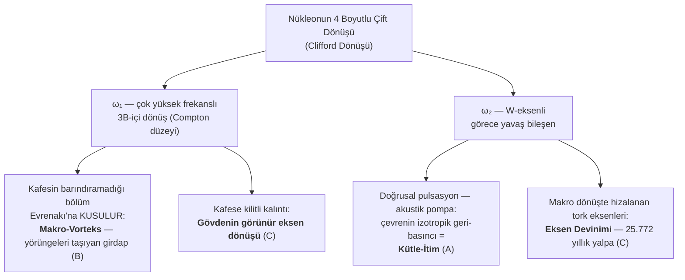

# 3.1 Evrenin Makine Dairesi: Nükleon ve Zitterbewegung

Standart fizikte atom altı parçacıkların dinamiklerini inceleyen Kuantum Mekaniği, parçacıkların mikroskobik ölçekte nedeni anlaşılamayan şiddetli bir titreşim (jitter) hareketi yaptığını öngörür. Schrödinger ve Dirac denklemlerinden türetilen ve fizik literatüründe **Zitterbewegung** olarak bilinen bu fenomen, standart teori tarafından "boşluk dalgalanması" veya soyut bir dalga fonksiyonunun yan etkisi olarak kabul edilir ve fiziksel mekanizması açıklanmadan matematiksel bir anomali olarak bırakılır.

Evrenakı Teorisi ise mikroskobik dünyayı soyut matematiksel dalgalar üzerinden değil, **4 Boyutlu Temel Dönüş (Clifford Dönüşü)** adı verilen saf bir geometrik hareket üzerinden tanımlar. (Bu konunun detaylı ispatları ve Epür izdüşümleri Kısım 1.4'te yapılmıştır.)

> **Bu kısım nasıl okunmalı:** Kısım 3'ün bölümleri, mekanizma zincirini mikrodan makroya doğru kurar; bu nedenle en soyut bölüm (3.1) başta yer alır. Akışkanlar mekaniğine aşina olmayan okuyucuya, önce gündelik analojilerle ilerleyen **Bölüm 3.5'i (Hortum Dinamikleri)** ve **Bölüm 3.6'yı (Atmosferik Hareketler)** okuyup ardından 3.1'e dönmesini öneririz; bölümler bu sırayla da kendi içinde tutarlıdır. Ayrıca 3.1'in sonundaki "İleri Okuma" alt bölümü, teorinin açık problemlerini literatür referanslarıyla tartışan teknik bir ektir ve ilk okumada atlanabilir.

> **Ön-Tanım — "Zerre" sözcüğünün bu kısımdaki kullanımı:** Kısım 2'de "Zerre", ışığı oluşturan kütleli mermiyi ($m_z$) adlandırdı. Bu kısımda aynı sözcük zaman zaman **Evrenakı ortamının mikroskobik parçacığı** anlamında da geçer (akışkan denklemlerindeki ortam yoğunluğu $\rho$ — eski yazım $\rho_z$ — veya Bölüm 3.10'daki "Zerre ortamı" gibi). Karışıklığı önlemek için kural şudur: ışık kastedildiğinde **"Zerre katarı / Zerre mermisi"**, ortam kastedildiğinde **"Evrenakı"** ya da **"Zerre ortamı"** ifadeleri kullanılır; yalın "Zerre", bağlamın açıkça gösterdiği anlamda okunmalıdır.

## 3.1.1 Mikrodan Makroya Geçiş: Sorunun Cevabı

Buraya kadar tek bir parçacığın dört boyutlu dönüşünün üç boyutta nasıl göründüğünü inceledik. Şimdi asıl soruya dönüyoruz: bu mikro dönüşler bir araya geldiğinde ne olur? İzleyen kesimler, Evrenakı Teorisi'nin en kritik sorularından birine tutarlı bir akışkanlar mekaniği perspektifi sunar: *"Madde durağan ise, gezegenlerin ve yıldızların etrafındaki devasa uzay girdaplarını (vorteksleri) sürekli olarak çeviren gizli motor nedir?"*

Standart kozmolojide kütle, uzayı bükerek pasif bir çukur yaratan ölü bir ağırlıktır. Ancak Evrenakı modelinde madde, etrafındaki süper-akışkan okyanusu durmaksızın pompalayan, çırpan ve girdaplaştıran **aktif bir motor kümesidir**. Bu devasa enerjinin kaynağı, en küçük atomik yapı taşlarındaki (nükleonlar/zerreler) **4 boyutlu çift dönüş** mekanizmasının mikrodan makroya geçerken yaşadığı "Kinetik Ayrışma"dır (Kinetic Decoupling).

## 3.1.2 Nükleonik Çift Dönüş: Mikroskobik Motorun Anatomisi

Bu bölümün epür analizlerinde (Kısım 1.4) gösterildiği üzere, bir parçacığın 4 boyutlu uzaydaki genel hareketi tek bir düzlemde değil, birbirine dik iki ayrı düzlemde aynı anda gerçekleşir (Clifford Dönüşü). 

Bir atom altı parçacık (nükleon) kendi doğası gereği bu çift dönüşü barındırır:
1. **Çok Yüksek Frekanslı Dönüş ($\omega_1$):** Üç boyutun içindeki bir düzlemde (Bölüm 1.4'teki epür analizinin birinci düzlem grubu) gerçekleşen, parçacığın varlığını sürdürmesini sağlayan, Compton frekansı düzeyindeki ($\nu_c \approx 10^{23}$ Hz, bkz. Bölüm 1) asıl enerji girdabıdır. Üç boyutta **görünür dönüş** üreten bileşen budur.
2. **Görece Yavaş Dönüş ($\omega_2$):** W eksenini içeren düzlemde (Bölüm 1.4'teki epür analizinin ikinci düzlem grubu) gerçekleşen, 4. boyuttan uzayımıza sarkan bileşendir. Epür analizinin gösterdiği üzere bu bileşen üç boyutta asla dönüş olarak görünmez; tek görünür etkisi, parçacığın eksenini periyodik olarak kaydırmasıdır (**devinim**).

Tek bir izole atom için bu iki dönüş iç içe geçmiş, kusursuz bir dans halindedir. Ancak trilyonlarca atom bir araya gelip makro bir kütle oluşturduğunda, akışkanlar mekaniği ve katı hal fiziği yasaları gereği bu iki frekans **birbirinden ayrışmak zorundadır.**

## 3.1.3 Kütlenin Birleşmesi ve Kinetik Ayrışma (Kinetic Decoupling)

Trilyonlarca atom kristal kafes (lattice) yapılarıyla birbirine kilitlenip gezegen veya yıldız gibi devasa bir "rijit katı" oluşturduğunda, bireysel atomların sınırsız serbestliği biter. Ancak bu atomların saniyede trilyonlarca kez gerçekleşen 4 boyutlu çift-dönüş frekansları ($\omega_1$ ve $\omega_2$) yok olmaz. Çift-dönüş mekanizmasının iki bileşeni, makro ölçekte **iki devasa akışkan dinamiğine** (Statik İtim ve Makro-Vorteks) ayrışır. Bu noktada doğanın kusursuz akustik ve hidrodinamik tahliye mekanizması devreye girer:

### A) W-Salınımının Akustik Pompası: Statik Kütle-İtiminin Doğuşu
Epür analizinde (Kısım 1.4) gördüğümüz üzere, dördüncü boyuttan (W ekseninden) 3 boyuta sarkan "doğrusal salınım/pulsasyon" hareketi, her bir atomu saniyede trilyonlarca kez genişleyip daralan **mikroskobik birer akustik pompaya** dönüştürür. Trilyonlarca atom bir gezegende birleştiğinde bu salınımların yönü rastgeledir; bu yüzden gezegen bütünüyle sağa sola titreşmez. Ancak bu muazzam titreşim enerjisi kafes içinde basit bir ısıya da dönüşmez; eğer dönüşseydi madde sürekli ısınır ve evrende hiçbir şey mutlak sıfıra yaklaşamazdı. Bu salınım sönümlenmez, enerjisini doğrudan ve kesintisiz olarak **merkezcil kuvvetin (kütle-itiminin) kaynağına**, yani Evrenakı'nı pompalamaya aktarır.
Bu trilyonlarca mikroskobik pompanın Evrenakı üzerinde yarattığı hidrodinamik netice şudur: Kütle hareketsiz (durağan) bile olsa, içerideki bu sürekli pulsasyon Evrenakı akışkanını merkezden dışarıya doğru radyal (ışınsal) olarak **sürekli iteler ve dışlar**.
* **Sonuç:** Merkezden sürekli dışarı atılan bu akışkanın yerini doldurmak için, çevredeki devasa Evrenakı okyanusu her yönden merkeze doğru muazzam bir geri-basınç uygular. Standart bilimin statik "kütleçekimi" dediği merkezcil kuvvet, uzayın geometrik olarak bükülmesi değil; titreşen (pulsasyon yapan) kütlenin Evrenakı'nı dışa itmesine karşılık, Evrenakı'nın kütleyi içeri doğru sıkıştırdığı bu **izotropik merkezcil kütle-itimidir**.

### B) Hızlı Dönüşün ($\omega_1$) Kusulması: Makro-Vorteks ve Yörüngelerin Doğuşu
Statik (radyal) itimin ötesinde, atomların üç boyut içindeki çok yüksek frekanslı asıl dönüşleri ($\omega_1$) katı kafes tarafından barındırılamaz. Katı madde bu devasa kinetik enerjiyi "kayma gerilimi" (shear stress) yoluyla dışarıdaki Evrenakı'na aktarır. Tıpkı dönen bir pervanenin (impeller) etrafındaki suyu kendi hızıyla çevirmesi gibi, trilyonlarca atomik pervane de dışarıdaki akışkanı teğetsel olarak çevirmeye başlar.
* **Sonuç:** Radyal statik itime ek olarak, kütlenin etrafında teğetsel (azimut) yönde dönen devasa bir akışkan girdabı (Makro-Vorteks) doğar. Uyduları ve gezegenleri kendi yörüngelerinde taşıyan, dönmeye zorlayan asıl nehir bu girdaptır. (Klasik fizikte buna Çerçeve Sürüklenmesi / Gravitomanyetizma denir).

### C) Kütlede Kalan Dönüş: Görünür Eksen Dönüşü ve Devinim
Tüm bu enerji Evrenakı'na kusulduktan sonra, kütlenin gövdesinde iki şey kalır:
* **Görünür eksen dönüşünün kaynağı:** $\omega_1$'in kafese kilitli kalan küçük bir kalıntısı ve kütlenin kendi kustuğu makro-vorteksin gövdeyi geri sürüklemesi gezegenin günlük görünür rotasyonunu başlatır.
* **Devinimin kaynağı ($\omega_2$):** Pulsasyonun (A maddesi) rastgele yönlerde sönümlenmesinin aksine, kütle makro ölçekte dönmeye başladığında, trilyonlarca atomun W bileşeninden gelen tork eksenleri hizalanır. Epürün öngördüğü eksen yalpalaması birbirini iptal etmez, aksine üst üste binerek makro ölçekte **eksen devinimini (precession)** yaratır. Dünyanın 25.772 yıllık yalpalama döngüsü, dışarıdan gelen bir tork değil, her bir atomun içsel 4B yalpalamasının makro sonucudur.

Kinetik Ayrışma'nın üç kanalı, tek şemada şöyle özetlenir:

## 3.1.4 Evrenin Makine Dairesi

Bu ayrışma mekanizması, Evrenakı Teorisi'ni salt bir geometri olmaktan çıkarıp kusursuz işleyen bir termodinamik ve hidrodinamik makineye dönüştürür. 

Eğer gökyüzüne bakıp gezegenleri döndüren, yıldız sistemlerini devasa girdaplarda bir arada tutan enerjinin nereden geldiğini sorarsanız, cevap uzayın görünmez eğriliklerinde değildir. Cevap, doğrudan maddenin kalbindedir:

**Kütle, oluştuğu an itibarıyla W-boyutu titreşimleriyle Evrenakı'nı dışlayarak statik kütle-itimini yaratır. Eş zamanlı olarak, "hızlı" (3B-içi) bileşeninin büyük bölümünü dışarıdaki Evrenakı'na pompalayarak devasa yörüngesel girdabı (Makro-Vorteks) oluşturur. Kafese kilitli kalan kalıntı rotasyon, gövdenin eksen dönüşünü üretirken, W-bileşeni torkları bu eksene karakteristik devinimini (Precession) işler.** Madde asla durağan bir ağırlık değildir; Evrenakı'nın sonsuz okyanusunda durmaksızın çalışan akustik ve mikrodinamik bir motordur.

*Özetle; 4. boyuttaki bu kök dönüşün 3. boyuta yansıması, boşlukta değil, doğrudan Evrenakı okyanusunun tam kalbinde gerçekleşir. Madde dediğimiz şey, Evrenakı'nı şekillendiren devasa sistemin mikroskobik motorları gibi hareket eder. Yıldızları ateşleyen, galaksileri sarmal girdaplara dönüştüren, gezegenleri devindiren ve kütleyi bir arada tutan her şey, bu potansiyel motorların eseri olabilir. Tüm makro evrenin mimarisi, 4. boyutun bu zarif dönüşünün 3. boyutlu uzayımızda durmaksızın çalışarak sonsuz akışkanı işlemesinin bir sonucu olabileceğini düşündürür.*

## 3.1.5 Gözlemsel Kanıt: Kütle Arttıkça Dönüş Neden Hızlanır?

Astronomik gözlemler çok net bir olguyu doğrular: **Kütle ve yoğunluk arttıkça, gök cisimlerinin kendi ekseni etrafındaki dönüş hızı (spin) muazzam şekilde artar.**
* Dünya (1 Dünya kütlesi) dönüşünü 24 saatte tamamlarken, ondan **318 kat daha ağır olan Jüpiter** bu dönüşü yalnızca 10 saatte tamamlar.
* Güneş'ten çok daha büyük kütleli yıldızlar çökerken (Nötron yıldızlarına veya Pulsarlara dönüşürken), dönüş hızları akıl almaz seviyelere çıkar (saniyede yüzlerce tur). 
* Evrendeki en devasa kütleli yapılar olan Karadelikler, etraflarındaki akışkanı ışık hızına yakın hızlarda çeviren birer "spin (dönüş) canavarlarıdır".

**Peki Klasik Fiziğin Zorlandığı Bu Duruma, Evrenakı'nın "Çift Dönüşlü Mikro-Motorlar" Modeli Nasıl Bir Çözüm Önerir?**

Cevap, sistemdeki toplam motor sayısının ve Evrenakı makro-girdabının katlanarak artmasıdır:
1. **Artan Mikro-Motor Sayısı (İç Dinamik):** Kütlenin artması demek, sisteme trilyonlarca yeni atomun, yani trilyonlarca yeni "4 boyutlu çift dönüşlü mikro-motorun" katılması demektir. Kütle büyüdükçe, kristal kafese veya çekirdeğe kilitlenen bu yeni parçacıkların her biri, kafeste tutulan $\omega_1$ (hızlı, 3B-içi) kalıntı torkunu ana kütlenin kolektif dönüşüne, $\omega_2$ (yavaş, W'li) bileşenini ise kolektif devinime ekler. Klasik fizikteki "Açısal momentumun korunumu", aslında bu milyarlarca mikro-motorun güçlerini birleştirmesinden başka bir şey değildir.
2. **Akışkan Girdabının Şiddetlenmesi (Dış Dinamik - Feedback Loop):** Kütle büyüdükçe, dışarıdaki Evrenakı'na pompalanan "hızlı dönüş ($\omega_1$)" frekansı ve miktarı da devasa ölçüde artar. Bu durum gezegenin veya yıldızın etrafındaki uzay boşluğunda inanılmaz şiddetli bir yörüngesel girdap (Makro-Vorteks) yaratır. Akışkanlar mekaniğinde, merkezdeki bir vorteks ne kadar güçlüyse, içindeki cismi sürükleme (entrainment) kuvveti de o kadar güçlü olur. Yani kütle, kendi yarattığı o muazzam akışkan kasırgasının merkezinde, kendi ürettiği akıntı tarafından da hızla döndürülmeye zorlanır.

Kısacası; **Kütle arttıkça dönüşün hızlanması tesadüf değildir. Kütle demek "dönüş" (spin) demektir.** Daha fazla kütle, daha fazla aktif motor ve Evrenakı içinde yaratılan çok daha hızlı bir kasırga anlamına gelir.

* **Güneş Sistemi Dışı Gezegenler (Exoplanets) ve $\beta$ Pictoris b Keşfi:** Astronomlar 2014 yılında VLT (Very Large Telescope) kullanarak Güneş sistemimiz dışındaki devasa bir gaz devi olan $\beta$ Pictoris b gezegeninin dönüş hızını ölçmüşlerdir (Snellen ve ark., 2014). Jüpiter'den yaklaşık 11 kat daha kütleli olan bu gezegenin, saatte 100.000 km gibi muazzam bir hızla döndüğü (ekvatoral dönüş hızı 25 km/s) bulunmuştur. Bu keşif, kütle arttıkça dönüş hızının artması kuralının sadece sistemimize has bir tesadüf değil, evrensel bir gerçeklik olabileceğini ve ötegezegenler için de geçerli olduğunu güçlü bir şekilde desteklemiştir.

### Evrenakı Hidrodinamik Dengesi: Girdap ve Basıncın Evrensel Rekabeti

Evrenakı'nın kütle ve dönüş üzerine kurduğu bu mekanizma, makro ölçekte kendi kendini dengeleyen (self-balancing) bir **"hidrodinamik denge"** fikri sunar. Bir gök cisminin kütlesi büyüdüğünde, sisteme eklenen trilyonlarca yeni motor iki zıt etkiyi eş zamanlı olarak şiddetlendirir:
1. **Yıkıcı Girdap (Kusulan $\omega_1$):** Motorların yüksek frekanslı 3B dönüşlerini Evrenakı'na kusması, kütleyi içeriden dışarıya hızlandırıp parçalamaya çalışan devasa bir makro-vorteks yaratır (Açısal ivmelenme ve Merkezkaç).
2. **Toparlayıcı Basınç (W-Pulsasyonu):** Aynı motorların W-eksenindeki akustik salınımları (nefes alma), Evrenakı okyanusunu dışa iterek her yönden merkeze doğru muazzam bir izotropik geri-basınç (Kütle-itim) doğurur.

Bu iki zıt Evrenakı kuvveti gök cisimlerinin kaderini belirler: Küçük ve gevşek yapılı asteroitlerde (rubble-pile) Evrenakı'nın oluşturduğu geri-basınç (kütle-itim) henüz çok zayıftır. Bu yüzden motorların akışkana kustuğu girdap, zayıf kayaç bütünlüğünü kolayca yener ve kütleyi kendi kendine hızlandırarak uzaya saçar (YORP parçalanması). 

Ancak Jüpiter gibi devasa kütlelere (gaz devlerine veya yıldızlara) gelindiğinde, dışarı kusulan vorteks enerjisi muazzam boyutlarda olsa da, W-salınımlarının Evrenakı'nda yarattığı akustik geri-basınç (kütle-itim) o kadar şiddetlidir ki; bu parçalayıcı girdabı tamamen ezer. Öyle ki, hiçbir katı kafesi olmayan hidrojen gazını bile sıvı metale dönüştürecek devasa bir sıkışma (hidrostatik denge) yaratarak sistemi kilitler ve gövdeyi bir arada tutar. Evrenakı modelinde madde; sadece uzayı çeviren değil, Evrenakı'nın geri-basıncını kullanarak kendi bütünlüğünü koruyan aktif bir hidrodinamik reaktördür.

*Not: Bu denge önerisi şu an için Newtonyen/Genel Görelilik hidrostatik denge modelleriyle aynı sayısal sonucu üretir; modeli standart fizikten ayırt edici hale getirecek olan şey, Evrenakı'nın öngördüğü akustik basıncın, klasik yerçekimsel basınçtan nicel bir sapma gösterdiği spesifik bir kütle rejiminin (örneğin çok düşük kütleli kahverengi cücelerin dejenerasyon sınırına yakın termodinamik davranışı) gelecekte tanımlanıp test edilmesidir.*

## 3.1.6 Güneş Paradoksunun Çözümü: Gezegen ve Yıldız Kategorileri

Dikkatli bir okuyucu, buradaki kurala apaçık bir karşı örnek görecektir: Güneş, sistemin kütlesinin %99,8'ini taşımasına rağmen, dönüşünü Jüpiter'in 10 saatine karşılık yaklaşık 27 günde tamamlar. Kütle→dönüş kuralı en büyük kütlede mi çöküyor? Hayır — çöken kural değil, gezegenlerle yıldızları **aynı merdivene dizen kıyasın kendisidir.** Kütle→dönüş kuralı iki ayrı kategori içinde, iki ayrı merdiven olarak işler ve bu ayrım keyfi değildir; doğrudan Kinetik Ayrışma mekanizmasının (Bölüm 3.1.3) yapısal ön koşulundan türer:

1. **Gezegenler (kafesli katılar) — dönüş kütleye KİLİTLENİR:** ω₁ kalıntılarının hizalanıp gövde dönüşü olarak birikebilmesi (Bölüm 3.1.3-C), atomları birbirine kilitleyen **rijit bir kristal kafes** gerektirir. Gezegenlerde bu kafes vardır; bu yüzden gezegen kategorisi içinde kütle arttıkça gövde dönüşü hızlanır (Mars → Dünya → Jüpiter → $\beta$ Pictoris b; hızlı dönen genç gezegen gözlemi için bkz. Snellen ve ark., 2014). Merkür ile Venüs bu merdivene dizilmez: dönüşleri Güneş girdabının rekabetiyle bastırılmış (kilitlenmiş) olduğundan serbest ifadeyi değil, kavranmış rejimi temsil ederler (Bkz. 3.4.4, kavrama klifi).
2. **Yıldızlar (kafessiz akışkanlar) — dönüş girdaba BOŞALIR:** Bir yıldız, kristal kafesi olmayan bir plazma topudur; atomlar birbirine kilitlenemez. Kilitlenemeyen dönüş bileşeni gövdede birikemez ve **doğrudan çevredeki Evrenakı'na boşalır.** Yıldız, birim kütle başına gövdesinde daha az dönüş tutar; buna karşılık çevresinde çok daha büyük bir makro-vorteks üretir. Güneş'in yavaşlığı motorunun zayıflığı değil, ürettiği dönüşü **gövdesinde değil, girdabında taşımasıdır.** (Yıldız kategorisinin kendi içinde ise kural yine işler: büyük kütleli sıcak yıldızların ekvator hızları 100–300 km/s mertebesine ulaşırken, Güneş gibi küçük kütleli sarı yıldızlar ~2 km/s ile döner.)

Bu ayrımın en güçlü yanı, standart fiziğin ünlü **"açısal momentum problemini"** muhasebe açığı olmaktan çıkarıp zorunlu bir sonuca dönüştürmesidir. Güneş sistemindeki dönme momentinin ezici çoğunluğu Güneş'in gövdesinde değil, gezegenlerin *yörünge hareketlerindedir* — kütle %99,8 Güneş'te, momentum gezegenlerde. Standart model için bu açıklanması güç bir dengesizliktir; Evrenakı çerçevesinde ise kayıp yoktur: **Güneş dönüşünü çevresindeki Evrenakı girdabına pompalamış, o girdap da gezegenleri sürükleyerek yörüngelerinde taşımaktadır** (Bkz. Bölüm 3.4 ve 3.8.1). Momentum Güneş'in gövdesinden çıkıp önce girdaba, oradan gezegen yörüngelerine aktarılmıştır — hesap kapanır.

İki bağımsız gözlem bu tabloyu ayrıca destekler:

* **Diferansiyel dönüş:** Güneş rijit bir cisim gibi dönmez; ekvatoru yaklaşık 25, kutup bölgeleri 34 günde tur atar. Katı bir cisim böyle dönemez — bu, tam bir akışkan girdap hız profili olup "yıldızda kafes kilidi yoktur" tezinin doğrudan gözlemsel imzasıdır. Güneş için yaptığımız açıklamalarda diferansiyel (gradyan) dönüşün temel sebebinin kristal kafes yapısının bulunmaması olduğu öne sürülmüştü. Ancak burada okuyucunun aklına şu haklı itiraz gelebilir: *"Evet ama Jüpiter gibi gaz devlerinde de diferansiyel dönüş mevcut değil mi?"* Unutulmamalıdır ki gaz devleri atmosferik akışkan bir yüzeye sahip olsalar da, derinlerinde devasa basınçlar altında sıkışmış, atomik/kristalize bir yapı (örn. metalik hidrojen) barındırırlar ve iç kısımlarda zayıf da olsa kolektif bir kafes/gövde dinamiğinden söz edilebilir. Tamamı plazmadan oluşan Güneş için ise katı bir gövde kilitlenmesi asla söz konusu olamaz. Nitekim gaz devlerinde gözlemlenen diferansiyel dönüş oranları, plazma yıldızlarına kıyasla son derece küçüktür.
* **Yaşla yavaşlama:** Genç yıldızlar hızlı döner ve yaşlandıkça yavaşlar. Evrenakı çerçevesinde bu, gövde dönüşünün girdaba **sürekli deşarjıdır** ve Bölüm 3.7'de anlatılan atomik mikro-girdap deşarj mekanizmasıyla aynı ailedendir.

Bu çözümleme, test edilebilir bir öngörü de üretir: aynı kütledeki iki yıldızdan, gezegen sistemi daha zengin olanın (dönüşünü girdap üzerinden gezegen yörüngelerine daha çok aktarmış olacağından) gövde dönüşünün daha yavaş olması beklenir.

## 3.1.7 Evrenakı Dinamiklerine Geçiş: Klasik İtirazlar ve Kuantum İzdüşümü

Buraya kadar kurduğumuz 4 boyutlu dönüş ve epür geometrisi, işin **kinematik** (hareketin tarifi) kısmıdır. Ancak dikkatli bir okuyucu veya bir klasik fizikçi haklı olarak şu itirazı getirebilir: *"Bu matematiksel model dönüşleri ve izdüşümleri çok iyi açıklıyor, ancak dinamiği (kuvveti ve enerjiyi) nereden geliyor? Ayrıca bu anlattığınız 4B yalpalamanın, bildiğimiz referans sistemine bağlı Coriolis kuvvetinin geometrik bir yorumundan farkı nedir?"*

Evrenakı Teorisi bu kritik sorular için mekanik ve tutarlı bir teorik çerçeve önerir:

**1. Kinematikten Dinamiğe Geçiş: Boşluk Değil, Akışkan**
Klasik fizikçi uzayı boşluk olarak düşündüğü için, geometrik dönüşün neden bir kuvvete veya makro-vortekse dönüşmesi gerektiğini sorgular. Evrenakı'nın temel önermesi, uzayın boş olmadığı; viskozitesi sıfıra çok yakın (ama sıfır olmayan) bir süper-akışkan olduğudur. Parçacığın 4 boyutlu dönüşü boşlukta dönen hayali bir nokta değil, **akışkanın içinde dönen bir motordur**. Bir parçacık bir kristal kafese kilitlenip serbest dönüşü engellendiğinde, o yüksek frekanslı ($\omega_1$) dönüş enerjisi yok olmaz; akışkanlar mekaniğindeki "kayma gerilimi" (shear stress) yoluyla dışarıdaki Evrenakı'na aktarılır. Yani Evrenakı dinamiğinde; statik kütle-itimini yaratan şey, dördüncü boyut salınımının bitmek bilmez pompaj gücü iken, galaksileri ve yörüngeleri sürükleyen makro-vorteks enerjisini yaratan şey, katı maddenin o yüksek frekanslı 3B dönüşünü akışkana deşarj etmek zorunda kalmasıdır. Olası bir Lagranjiyen yaklaşımı, parçacığın salt kinetik enerjisini değil, Evrenakı akışkanıyla olan hidrodinamik etkileşim (drag/vorticity) enerjisini de içermelidir.

**2. Coriolis Kuvveti (Coriolis, 1835) Değil, İçsel (Intrinsic) Tork**
Coriolis, dönen bir referans sisteminde hareket eden cisimlerde gözlemlenen ve tamamen gözlemcinin çerçevesine bağlı olan bir sözde-kuvvettir (pseudo-force). Eğer Dünya dönmeseydi, Coriolis etkisi olmazdı. Evrenakı'ndaki 4B dönüş ise referans sisteminden tamamen **bağımsız, mutlak ve içsel** bir rotasyondur. Kütle hareketsiz veya dönmüyor bile olsa, içindeki atomların W bileşenindeki mikroskobik dönüşleri asimetrik bir yalpalamaya neden olur. Standart fizikte makro ölçekte gezegenin devinimi (precession), dışarıdan uygulanan (Güneş veya Ay kaynaklı) kütleçekim torklarına bağlanır. Evrenakı'na göre ise bu devinim, salt dışarıdan gelen bir torkun sonucu değil, içerideki trilyonlarca atomun W bileşeni dönüşünün makro gövdeye yansıyan kolektif ve içsel torkudur.

**3. "Dönüş Görünmez, Salınım Görünür" ve Kuantum Mekaniği**
Eğer dördüncü (W) boyutu gerçek bir uzay ekseniyse, parçacıkların neden o yöne doğru dağılmadığı veya o eksende neden bir enerji ölçmediğimiz sorulabilir. Bizim 3 boyutlu uzayımız, 4B Evrenakı okyanusunda spesifik bir zardır (brane) veya rezonans düzlemidir ($w=0$). Nükleonlar, o inanılmaz hızlı varoluş frekanslarıyla ($\omega_1$) bu zara tutunurlar ve W yönünde öteleme yapamazlar; yalnızca W düzleminde dönebilirler.
Enerjisini ölçemiyor muyuz? **Aslında her an ölçüyoruz, ancak adını Kuantum Mekaniği koyuyoruz.** Bölüm analizinin en çarpıcı sonucu olan *"Dönüş görünmez, ancak 3 boyutta salınım (titreşim) olarak görünür"* ilkesi, Kuantum Mekaniğindeki dalga fonksiyonunun ve de Broglie'nin "Madde Dalgaları"nın fiziksel kökenine dair zarif bir yorum sunar. Parçacığın 3B kesitimizde bir dalga veya salınım (Zitterbewegung) gibi davranması, 4. boyuttaki dönüşünün uzayımıza periyodik bir pulsasyon (nefes alma) olarak izdüşmesi fikriyle kusursuzca örtüşür. Kuantum dalga denklemleri (Schrödinger), aslında bu 4 boyutlu dönüşün 3 boyutlu izdüşüm harmoniklerinin bir yansıması olabileceğini düşündürür.

## 3.1.8 Gözlemsel Anomalilerin Çöküşü: Kendi Kendine Hızlanan Kütleler ve Karanlık Madde

Bu bölüm boyunca kurduğumuz "Evrenakı akışkanı ve mikroskobik motorlar" altyapısı, evrende gözlemlenen ve standart fiziğin açıklamakta çok zorlandığı, dışarıdan hiçbir tork almadan **"kendi kendine hızlanan" veya "açıklanamayan aşırı dönüşlere sahip"** astronomik anomaliler için zarif ve tutarlı bir açıklama potansiyeli taşır.

Standart fizik bu olayları açıklayabilmek için görünmez maddeler, karmaşık iç-sıvı modelleri veya tuhaf "foton" itkileri icat etmek zorunda kalmıştır. Oysa Evrenakı'nın **"Kütle, dönüş üreten bir motordur"** prensibiyle tüm bu olaylar tek bir kalemde, doğal bir akışkanlar mekaniği dinamiği olarak açıklanma fırsatı bulur:

### 1. Karanlık Madde İllüzyonu (Galaksilerin Aşırı Hızlı Dönüşü)
Standart fiziğin "Karanlık Madde"yi icat etme sebebi doğrudan galaktik yörünge dönüşleriyle ilgilidir. Astronomlar, galaksilerin dış kollarındaki yıldızların o kadar hızlı döndüğünü fark etmişlerdir ki, Newton ve Kepler yasalarına (Newton, 1687) göre merkezdeki kütlenin çekim gücü bu yıldızları tutmaya yetmemeli, hepsi uzaya savrulmalıydı. Çözüm olarak, galaksinin etrafını saran ama doğrudan gözlemlenememiş "Karanlık Madde" (Dark Matter) adlı hipotetik bir kütle öne sürülmüştür (Zwicky, 1933; Rubin ve ark., 1980).
* **Evrenakı Çözümü:** Bölüm 3.1.3'te kanıtladığımız üzere; yıldızları yörüngede tutan şey statik çekim değil, yıldızların $\omega_1$ (hızlı 3B dönüş) deşarjıyla Evrenakı'nda yarattıkları devasa **Makro-Vortekstir**. Galaksi devasa bir çorba kasesi gibidir; merkezdeki milyarlarca yıldızın motoru bu çorbayı durmaksızın karıştırır. Dışarıdaki yıldızlar statik çekimle tutunmaya çalışmıyorlar, o devasa akışkan girdabının (akıntının) içinde hidrodinamik olarak taşınıyorlar. Akışkanlar mekaniğinde devasa bir girdabın dış kolları zaten tam olarak astronomların gözlemlediği hızda döner. Ortada eksik veya karanlık bir kütle yoktur, sadece uzayın ultra-düşük viskoziteli bir süper-akışkan olduğu gerçeğinin yok sayılması vardır.

### 2. Kendi Kendine Hızlanan ve Parçalanan Asteroitler (YORP Etkisi)
Uzay boşluğunda süzülen yalnız asteroitlerin (örneğin *54509 YORP* asteroidi) hiçbir çarpışma yaşamadıkları halde dönüş hızlarının sürekli arttığı gözlemlenmiştir (Lowry ve ark., 2007). Hatta bazıları o kadar hızlanır ki, merkezkaç kuvvetine dayanamayıp kendi kendilerine parçalanırlar (rotational fission; Walsh ve ark., 2008).
* **Klasik Fiziğin İzahı:** Asteroidin Güneş'ten aldığı ısıyı uzaya kızılötesi "foton" olarak geri yaydığını, bu ışınımın asteroidin şeklindeki asimetriler yüzünden uzayda "küçük pervaneler/roketler" gibi itki yaratıp kütleyi döndürdüğünü (YORP Etkisi) öne sürerler.
* **Evrenakı Çözümü:** Milyarlarca tonluk kayayı ışınım rüzgarıyla döndürmeye gerek yoktur. Kütleyi oluşturan trilyonlarca atomik motor zaten sürekli olarak 3B-içi dönüşlerini ($\omega_1$) dışarı kusmaktadır. Eğer asteroidin kristal kafes yapısı zayıfsa, içindeki bu motorların ürettiği girdap onu içeriden dışarıya doğru hızlandırır ve sonunda parçalar. Bu durum, "Kütle kendi kendine dönüş yaratır" öngörüsünü destekleyen güçlü bir gözlemsel veridir.

### 3. Pulsar Glitch (Atarca Hızlanma Anomalisi)
Nötron yıldızları (pulsarlar) enerjilerini Evrenakı'na kusarken normalde yavaşlarlar. Ancak astronomlar, bazı pulsarların dışarıdan hiçbir etki (çarpma, madde yutma vb.) olmadan aniden ve kendiliğinden dönüş hızlarını artırdıklarını gözlemliyorlar. Buna "Pulsar Glitch" denir (Radhakrishnan & Manchester, 1969).
* **Klasik Fiziğin Yaması:** Yıldızın içinde görünmez bir "süper-akışkan" tabakası olduğunu ve bu akışkanın aniden kabuğa sürtünerek onu hızlandırdığını varsayarlar.
* **Evrenakı Çözümü:** Kütle zaten içsel olarak 4 boyutlu dönüş enerjisini barındırır. Nötron yıldızları gibi inanılmaz yoğunluktaki yapılarda, içeride sıkışan bu dönüş enerjisinin (atomik motorların) Evrenakı'na ani deşarjları (boşalmaları), makro gövdenin kendi kendine aniden tork kazanmasına ve hızlanmasına neden olur.

## İleri Okuma: Açık Problemler ve Parametrik Davetler

*(Bu alt bölüm, teorinin henüz sabitlenmemiş parametrelerini ve önerilen test tasarımlarını literatür referanslarıyla tartışan teknik bir ektir; genel okuyucu ana argümanı kaybetmeden bir sonraki bölüme geçebilir. Buradaki açık problemler Kısım 7.4'te de listelenmiştir.)*

### Parametrik Bir Davet: $\eta_E$ (Evrenakı Vizkozitesi) ve Gaia Verileri

Evrenakı akışkanının dinamik viskozite parametresi ($\eta_E$, birimi Pa·s), şu anki aşamada sayısal olarak açık bırakılmıştır. (Birim seçimi keyfî değildir: $\eta_E$'nin teorideki fiziksel rolü, ortamın **teğetsel momentum iletme kapasitesi**dir — hem Bölüm 3.1.3-B'deki kayma gerilimi yoluyla $\omega_1$ deşarjı hem de Bölüm 3.10.4.2'deki Stokes sönüm formülü $6\pi\eta_E r_t/m$, dinamik viskozite gerektirir. Hesaplamalarda kinematik biçim gerektiğinde $\nu_E = \eta_E/\rho_0$ türetilir.) Bu değeri doğrudan sabitleyecek olan gözlem — galaksilerin dış kollarındaki yörünge dönüş eğrilerinin saf bir Navier-Stokes akışkan girdabı (vorteks) profili olarak analiz edilmesi — mevcut astronomik veriler (örneğin Gaia DR3 setleri) üzerinde bu perspektifle henüz hiç hesaplanmamıştır. Bu bölümde kurulan Makro-Vorteks ilişkisi; merkezdeki yıldızların ürettiği kolektif $\omega_1$ dönüş deşarjı ile dış kolların sürüklenme hızı arasındaki fark, bir Hesaplamalı Akışkanlar Dinamiği (CFD) modeline oturtulduğunda, $\eta_E$ parametresi için çok hassas bir üst sınır (upper limit) hesaplanabilmesine olanak tanır.

*Not: Bölüm 3.10'da Satürn halkalarındaki (Mimas 5:3 rezonansı) dikey salınım sönümü bağlamında ele alınan katsayı da **aynı parametredir** — teorinin tek viskozite parametresi $\eta_E$'dir (Ek C, satır 14; eski metinlerde $\eta_z$ olarak anılmıştır). Aynı parametrenin iki bağımsız ölçekte ölçülebilir olması (Satürn halkası sönümü ve galaktik dönüş eğrisi), teoriye güçlü bir çapraz-doğrulama sınavı tanımlar: iki ölçüm aynı $\eta_E$ değerini vermek zorundadır. Lokal sönümden kolektif kuplaja geçişte etkin değerin ölçeğe bağlı sapma gösterip göstermeyeceği ise ayrı bir ölçek-geçiş (scale-bridging) modeliyle sınanacak açık bir sorudur; sapma bulunursa bu, tek-parametre varsayımının yanlışlanması anlamına gelir.*

### Parametrik Bir Davet: $\kappa_d$ (İçsel Deşarj Sabiti) ve Katalog Verileri

Bu bölümde önerilen "kendi kendine hızlanma" mekanizmasının ortak paydası, kütlenin kristal kafes bütünlüğü ile içindeki $\omega_1$ deşarj hızı arasındaki ilişkiyi tanımlayan bir **içsel deşarj sabiti** ($\kappa_d$) olarak formüle edilebilir. Bu sabit şu anki aşamada sayısal olarak açık bırakılmıştır, çünkü onu doğrudan sabitleyecek olan karşılaştırmalı analiz — farklı kafes bütünlüğüne sahip cisimlerin (gevşek "rubble-pile" asteroitler ile yoğun nötron yıldızı kabukları) ölçülen açısal ivmelenme değerlerinin tek bir ölçeklenebilir yasaya oturtulması — henüz yapılmamıştır.

Mevcut gözlemsel çapa noktaları şunlardır: asteroid (54509) YORP için ölçülen açısal ivmelenme $d\omega/dt = 2.0 (\pm0.2) \times 10^{-4}\ {}^\circ/\text{gün}^2$ (Lowry ve ark., 2007); Vela pulsarı (PSR 0833-45) için gözlenen glitch büyüklüğü $\Delta\nu/\nu \approx 2\times10^{-6}$ (Radhakrishnan & Manchester, 1969). Bu iki değer, $\kappa_d$'nin en az 15-20 mertebe farklı rejimlerde (gevşek kayaç kütlesi vs. dejenere nötron maddesi) ölçüldüğü anlamına gelir; bu nedenle tek bir evrensel sabitten değil, kafes/malzeme türüne bağlı bir **fonksiyon ailesinden** söz etmek daha doğru olacaktır.

*Not: Asteroid ölçeğindeki $\kappa_d$ ile pulsar ölçeğindeki $\kappa_d$'nin aynı içsel deşarj mekanizmasının iki ucu olduğu varsayımı, mevcut YORP kataloğu (Minor Planet Center) ve pulsar glitch kataloğu (ATNF) verilerinin çapraz analiziyle test edilebilir bir öngörüdür. Ancak gevşek kayaç yapısından dejenere madde kabuğuna geçişte malzeme davranışının aynı yasayla ölçeklenip ölçeklenmeyeceği, kendi başına ayrı bir malzeme-fiziği problemidir ve bu, şu an açık bırakılmıştır.*

### Parametrik Bir Davet: Ayırt Edici Bir İmza Arayışı

Bölüm 3.1.7'de önerilen "Zitterbewegung = W-bileşeni salınımı" özdeşliği şu ana kadar **ayırt edici değildir** — yani bu özdeşlik doğru olsa da yanlış olsa da, mevcut kuantum mekaniği gözlemleriyle aynı sayısal sonucu üretir. Schrödinger'in (1930) orijinal hesabına göre, serbest bir elektron için bu titreşimin frekansı $\omega_Z \approx 2mc^2/\hbar$ (yaklaşık $10^{21}\ \text{rad/s}$ mertebesinde) ve genliği Compton dalga boyu ölçeğindedir ($\sim 3.86\times10^{-3}\ \text{Å}$) — bu denli yüksek frekans ve düşük genlik, gerçek bir serbest elektron üzerinde bugüne dek hiç doğrudan gözlenememiştir. Fenomen yalnızca tuzaklanmış iyon sistemlerinde bir *analog simülasyon* olarak doğrulanmıştır (Gerritsma ve ark. 2010), gerçek bir vakum elektronunda değil.

Bu durum Evrenakı Teorisi için hem bir zorluk hem bir fırsattır: Eğer W-bileşeni salınımı gerçekten Zitterbewegung'un fiziksel kökeniyse, Evrenakı akışkanının yerel özellikleri (örneğin $\eta_E$ veya ortam yoğunluğu) bu salınımın frekansında veya sönümünde, standart Dirac denkleminin öngörmediği **ek bir ince yapı** (fine structure) veya çevre-bağımlı bir kayma üretmelidir. Böyle bir kayma, örneğin farklı $\eta_E$ ortamlarında (yıldızlararası boşluk vs. yoğun gaz bulutu) tekrarlanan tuzaklanmış-iyon Zitterbewegung deneylerinde aranabilir.

*Not: Bu, şu anki manuskride henüz önerilmemiş, tamamen açık bir test tasarımıdır. Mevcut haliyle 3.1.7'deki özdeşlik, Dirac denkleminin zaten bildiği bir olguyu yeniden yorumlamaktan ibarettir; teoriyi standart kuantum mekaniğinden ayıracak olan şey, yukarıdaki gibi ortam-bağımlı bir sapmanın nicel olarak öngörülüp deneyle aranmasıdır.*

